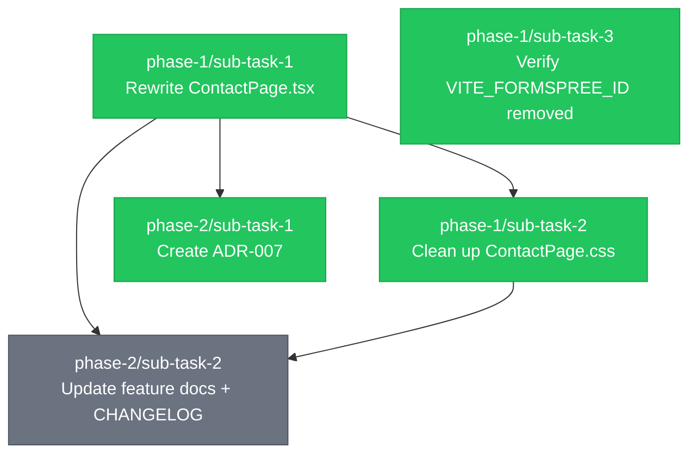

# Task Decomposition: Replace Formspree with Google Forms Embed

**Source:** `REQUIREMENTS-refactor-contact-google-forms.md`
**Branch:** `refactor/contact-google-forms`
**Created:** 2026-05-19
**Status:** pending

## Overview

Replace the custom Formspree-backed contact form with a Google Forms iframe embed. Remove all form state, async logic, and the `VITE_FORMSPREE_ID` env var from the codebase. Document the decision in ADR-007 and bring all feature docs in sync with the new implementation.

## Dependency Graph

## Execution Order

| Wave | Sub-Tasks | Description |
|------|-----------|-------------|
| 1 | phase-1/sub-task-1, phase-1/sub-task-3 | No dependencies — both start immediately |
| 2 | phase-1/sub-task-2, phase-2/sub-task-1 | Both depend on sub-task-1 completing |
| 3 | phase-2/sub-task-2 | Depends on sub-task-1 and sub-task-2 |

## Phases

### Phase 1: Code Changes
**Goal:** Remove all Formspree logic from source files and replace the contact form with a Google Forms iframe.

| # | Sub-Task | Status | Depends On | Commit |
|---|----------|--------|------------|--------|
| 1 | [Rewrite ContactPage.tsx](phase-1/sub-task-1.md) | completed | — | 845b2f7 |
| 2 | [Clean up ContactPage.css](phase-1/sub-task-2.md) | completed | sub-task-1 | abdde67 |
| 3 | [Verify VITE_FORMSPREE_ID removed](phase-1/sub-task-3.md) | completed | — | 5b1920b |

### Phase 2: Documentation
**Goal:** Record the architectural decision in an ADR and bring all feature docs in sync with the new implementation.

| # | Sub-Task | Status | Depends On | Commit |
|---|----------|--------|------------|--------|
| 1 | [Create ADR-007](phase-2/sub-task-1.md) | completed | phase-1/sub-task-1 | 7115587 |
| 2 | [Update feature docs + CHANGELOG](phase-2/sub-task-2.md) | pending | phase-1/sub-task-1, phase-1/sub-task-2 | — |

## Progress

| Phase | Tasks | Completed | Status |
|-------|-------|-----------|--------|
| Phase 1: Code Changes | 3 | 3 | Complete |
| Phase 2: Documentation | 2 | 1 | In progress |
| **Total** | **5** | **4** | **80%** |
