# Task Decomposition: Firebase Firestore Migration

**Source:** `firebase-migration-plan.md`
**Branch:** `feature/firebase-firestore-migration`
**Created:** 2026-04-18
**Status:** pending

## Overview

Migrate the Late Night Happy Hour Bowling League site from static JSON files to Firebase Firestore.
The migration involves publishing security rules, seeding all 12 Firestore collections from existing
data, reworking the transform pipeline to write directly to Firestore, migrating all React components
to read from Firestore via custom hooks, building an Admin CRUD UI, and cleaning up all legacy files.

## Dependency Graph

```mermaid
graph TD
    %% Phase 1: Firebase Foundation
    P1S1["phase-1/sub-task-1<br/>Security Rules + Firebase Config"]
    P1S2["phase-1/sub-task-2<br/>Seed Script (12 collections)"]
    P1S3["phase-1/sub-task-3<br/>Run Seed + Validation Script"]

    %% Phase 2: Transform Script Rework
    P2S1["phase-2/sub-task-1<br/>firebase-admin Setup + Batch Write Helper"]
    P2S2["phase-2/sub-task-2<br/>leagueConfig Collection Mapping"]
    P2S3["phase-2/sub-task-3<br/>Expanded Teams + Bowlers Mapping"]
    P2S4["phase-2/sub-task-4<br/>bowlerScores: Blind/PreBowl/Substitute"]
    P2S5["phase-2/sub-task-5<br/>positionRound + FK Fix + Full Batch Write"]

    %% Phase 3: React Foundation
    P3S1["phase-3/sub-task-1<br/>TypeScript Schema Types"]
    P3S2["phase-3/sub-task-2<br/>Firestore Hooks (Generic + Domain)"]

    %% Phase 4: Component Migration
    P4S1["phase-4/sub-task-1<br/>Standings + Teams + Matchups Components"]
    P4S2["phase-4/sub-task-2<br/>Scores + Schedule + Seasons Components"]
    P4S3["phase-4/sub-task-3<br/>Bowler Components"]
    P4S4["phase-4/sub-task-4<br/>Admin Display + Home + Bylaws Components"]

    %% Phase 5: Admin CRUD UI
    P5S1["phase-5/sub-task-1<br/>Auth Login + Route Guard + Admin Layout"]
    P5S2["phase-5/sub-task-2<br/>Announcements + Events + Carousel CRUD"]
    P5S3["phase-5/sub-task-3<br/>Documents Admin + PDF Upload + Versioning"]

    %% Phase 6: Cleanup & Optimization
    P6S1["phase-6/sub-task-1<br/>Delete JSON Files + Fix TypeScript Errors"]
    P6S2["phase-6/sub-task-2<br/>Composite Firestore Indexes"]
    P6S3["phase-6/sub-task-3<br/>onSnapshot Real-Time Listeners + Docs Update"]

    %% Dependencies
    P1S1 --> P1S2
    P1S2 --> P1S3
    P1S1 --> P2S1
    P1S1 --> P3S2
    P1S1 --> P5S1
    P2S1 --> P2S2
    P2S1 --> P2S3
    P2S1 --> P2S4
    P2S2 --> P2S5
    P2S3 --> P2S5
    P2S4 --> P2S5
    P3S1 --> P3S2
    P3S2 --> P4S1
    P3S2 --> P4S2
    P3S2 --> P4S3
    P3S2 --> P4S4
    P5S1 --> P5S2
    P5S1 --> P5S3
    P4S1 --> P6S1
    P4S2 --> P6S1
    P4S3 --> P6S1
    P4S4 --> P6S1
    P2S5 --> P6S2
    P4S1 --> P6S3
    P4S2 --> P6S3
    P4S3 --> P6S3
    P4S4 --> P6S3

    %% Status styling
    classDef completed fill:#22c55e,stroke:#16a34a,color:#fff
    classDef inprogress fill:#eab308,stroke:#ca8a04,color:#fff
    classDef pending fill:#6b7280,stroke:#4b5563,color:#fff
    classDef blocked fill:#ef4444,stroke:#dc2626,color:#fff

    %% Apply status classes
    class P1S1 completed
    class P1S2 completed
    class P1S3 completed
    class P2S1 completed
    class P2S2 completed
    class P2S3 completed
    class P2S4 completed
    class P2S5 pending
    class P3S1 completed
    class P3S2 completed
    class P4S1 completed
    class P4S2 completed
    class P4S3 completed
    class P4S4 completed
    class P5S1 completed
    class P5S2 completed
    class P5S3 pending
    class P6S1 pending
    class P6S2 pending
    class P6S3 pending
```

## Execution Order

| Wave | Sub-Tasks | Description |
|------|-----------|-------------|
| 1 | phase-1/sub-task-1, phase-3/sub-task-1 | No dependencies — firebase config + schema types can start immediately |
| 2 | phase-1/sub-task-2, phase-2/sub-task-1, phase-3/sub-task-2, phase-5/sub-task-1 | Depend on Wave 1 foundations |
| 3 | phase-1/sub-task-3, phase-2/sub-task-2, phase-2/sub-task-3, phase-2/sub-task-4, phase-4/sub-task-1, phase-4/sub-task-2, phase-4/sub-task-3, phase-4/sub-task-4, phase-5/sub-task-2, phase-5/sub-task-3 | Parallel expansion wave |
| 4 | phase-2/sub-task-5 | Requires all transform sub-tasks from Wave 3 |
| 5 | phase-6/sub-task-1, phase-6/sub-task-2, phase-6/sub-task-3 | Final cleanup — all components migrated, transform complete |

## Phases

### Phase 1: Firebase Foundation & Schema Validation
**Goal:** Publish security rules, seed all 12 Firestore collections from existing JSON files, and verify schema.

| # | Sub-Task | Status | Depends On | Commit |
|---|----------|--------|------------|--------|
| 1 | [Security Rules + Firebase Config](phase-1/sub-task-1.md) | completed | — | f8d255d |
| 2 | [Seed Script (12 collections)](phase-1/sub-task-2.md) | completed | sub-task-1 | 0fbcb83 |
| 3 | [Run Seed + Validation Script](phase-1/sub-task-3.md) | completed | sub-task-2 | 3881d1b |

### Phase 2: Transform Script Rework
**Goal:** Rework `scripts/transform-data.js` to write directly to Firestore using the corrected schema.

| # | Sub-Task | Status | Depends On | Commit |
|---|----------|--------|------------|--------|
| 1 | [firebase-admin Setup + Batch Write Helper](phase-2/sub-task-1.md) | completed | phase-1/sub-task-1 | cd9cd6f |
| 2 | [leagueConfig Collection Mapping](phase-2/sub-task-2.md) | completed | sub-task-1 | 7a7e090 |
| 3 | [Expanded Teams + Bowlers Mapping](phase-2/sub-task-3.md) | completed | sub-task-1 | d6c1db8 |
| 4 | [bowlerScores: Blind/PreBowl/Substitute](phase-2/sub-task-4.md) | completed | sub-task-1 | b54f474 |
| 5 | [positionRound + FK Fix + Full Batch Write](phase-2/sub-task-5.md) | pending | sub-task-2, sub-task-3, sub-task-4 | — |

### Phase 3: React Foundation — Types & Hooks
**Goal:** Update TypeScript types to the new schema and create all Firestore read hooks.

| # | Sub-Task | Status | Depends On | Commit |
|---|----------|--------|------------|--------|
| 1 | [TypeScript Schema Types](phase-3/sub-task-1.md) | completed | — | e143052 |
| 2 | [Firestore Hooks (Generic + Domain)](phase-3/sub-task-2.md) | completed | sub-task-1, phase-1/sub-task-1 | a8e5399 |

### Phase 4: React Component Migration
**Goal:** Replace all static JSON imports in all React components with Firestore hooks.

| # | Sub-Task | Status | Depends On | Commit |
|---|----------|--------|------------|--------|
| 1 | [Standings + Teams + Matchups Components](phase-4/sub-task-1.md) | completed | phase-3/sub-task-2 | e3fe5cf |
| 2 | [Scores + Schedule + Seasons Components](phase-4/sub-task-2.md) | completed | phase-3/sub-task-2 | 1de4d54 |
| 3 | [Bowler Components](phase-4/sub-task-3.md) | completed | phase-3/sub-task-2 | 6ed73fb |
| 4 | [Admin Display + Home + Bylaws Components](phase-4/sub-task-4.md) | completed | phase-3/sub-task-2 | c03bb6f |

### Phase 5: Admin CRUD UI
**Goal:** Build Firebase Auth–gated admin panels for all admin-managed Firestore collections.

| # | Sub-Task | Status | Depends On | Commit |
|---|----------|--------|------------|--------|
| 1 | [Auth Login + Route Guard + Admin Layout](phase-5/sub-task-1.md) | completed | phase-1/sub-task-1 | c554c80 |
| 2 | [Announcements + Events + Carousel CRUD](phase-5/sub-task-2.md) | completed | sub-task-1 | a18c921 |
| 3 | [Documents Admin + PDF Upload + Versioning](phase-5/sub-task-3.md) | pending | sub-task-1 | — |

### Phase 6: Cleanup & Optimization
**Goal:** Remove all legacy JSON files, create composite indexes, add real-time listeners, update documentation.

| # | Sub-Task | Status | Depends On | Commit |
|---|----------|--------|------------|--------|
| 1 | [Delete JSON Files + Fix TypeScript Errors](phase-6/sub-task-1.md) | pending | phase-4/sub-task-1 through 4 | — |
| 2 | [Composite Firestore Indexes](phase-6/sub-task-2.md) | pending | phase-2/sub-task-5 | — |
| 3 | [onSnapshot Listeners + Docs Update](phase-6/sub-task-3.md) | pending | phase-4/sub-task-1 through 4 | — |

## Progress

| Phase | Tasks | Completed | Status |
|-------|-------|-----------|--------|
| Phase 1: Firebase Foundation | 3 | 3 | Complete |
| Phase 2: Transform Script Rework | 5 | 4 | In progress |
| Phase 3: React Foundation | 2 | 2 | Completed |
| Phase 4: Component Migration | 4 | 2 | In progress |
| Phase 5: Admin CRUD UI | 3 | 2 | In progress |
| Phase 6: Cleanup & Optimization | 3 | 0 | Not started |
| **Total** | **20** | **12** | **60%** |
