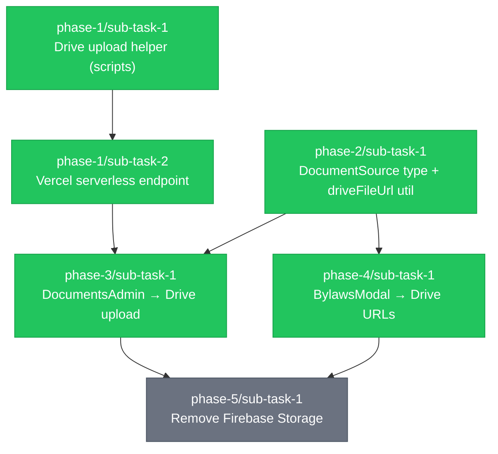

# Task Decomposition: Google Drive Storage — Bylaws

**Source:** `REQUIREMENTS-feature-google-drive-storage.md`
**Branch:** `feature/google-drive-storage`
**Created:** 2026-04-22
**Status:** pending

## Overview

Replace Firebase Storage with Google Drive for bylaws PDF storage. Firebase Storage
costs money and is currently only used in `DocumentsAdmin.tsx`. This migration adds
a Vercel serverless upload endpoint (so browser-side code never touches the service
account key), updates the admin UI and frontend display to use Drive file IDs, and
then removes Firebase Storage entirely.

## Dependency Graph

## Execution Order

| Wave | Sub-Tasks | Description |
|------|-----------|-------------|
| 1 | phase-1/sub-task-1, phase-2/sub-task-1 | No dependencies — run in parallel |
| 2 | phase-1/sub-task-2 | Depends on phase-1/sub-task-1 |
| 3 | phase-3/sub-task-1, phase-4/sub-task-1 | phase-3 depends on wave-2 + phase-2; phase-4 depends on phase-2 |
| 4 | phase-5/sub-task-1 | Depends on phase-3 and phase-4 both complete |

## Phases

### Phase 1: Infrastructure
**Goal:** Server-side Drive utilities and the Vercel upload endpoint that the admin UI will call.

| # | Sub-Task | Status | Depends On | Commit |
|---|----------|--------|------------|--------|
| 1 | [Drive upload helper (scripts)](phase-1/sub-task-1.md) | completed | — | 1246777 |
| 2 | [Vercel serverless endpoint](phase-1/sub-task-2.md) | completed | sub-task-1 | 7127702 |

### Phase 2: Types & Utilities
**Goal:** Update shared TypeScript types and add the Drive URL helper used by both admin and frontend.

| # | Sub-Task | Status | Depends On | Commit |
|---|----------|--------|------------|--------|
| 1 | [DocumentSource type + driveFileUrl util](phase-2/sub-task-1.md) | completed | — | 09780ef |

### Phase 3: Admin UI
**Goal:** DocumentsAdmin uploads PDFs to Drive instead of Firebase Storage.

| # | Sub-Task | Status | Depends On | Commit |
|---|----------|--------|------------|--------|
| 1 | [DocumentsAdmin → Drive upload](phase-3/sub-task-1.md) | completed | phase-1/sub-task-2, phase-2/sub-task-1 | 378f49e |

### Phase 4: Frontend Display
**Goal:** BylawsModal serves PDFs from Drive file IDs instead of Firebase Storage URLs.

| # | Sub-Task | Status | Depends On | Commit |
|---|----------|--------|------------|--------|
| 1 | [BylawsModal → Drive URLs](phase-4/sub-task-1.md) | completed | phase-2/sub-task-1 | 287dbeb |

### Phase 5: Cleanup
**Goal:** Remove Firebase Storage entirely — imports, config, rules, env vars.

| # | Sub-Task | Status | Depends On | Commit |
|---|----------|--------|------------|--------|
| 1 | [Remove Firebase Storage](phase-5/sub-task-1.md) | pending | phase-3/sub-task-1, phase-4/sub-task-1 | — |

## Progress

| Phase | Tasks | Completed | Status |
|-------|-------|-----------|--------|
| Phase 1: Infrastructure | 2 | 2 | Complete |
| Phase 2: Types & Utilities | 1 | 1 | Complete |
| Phase 3: Admin UI | 1 | 1 | Complete |
| Phase 4: Frontend Display | 1 | 1 | Complete |
| Phase 5: Cleanup | 1 | 0 | Not started |
| **Total** | **6** | **5** | **83%** |
