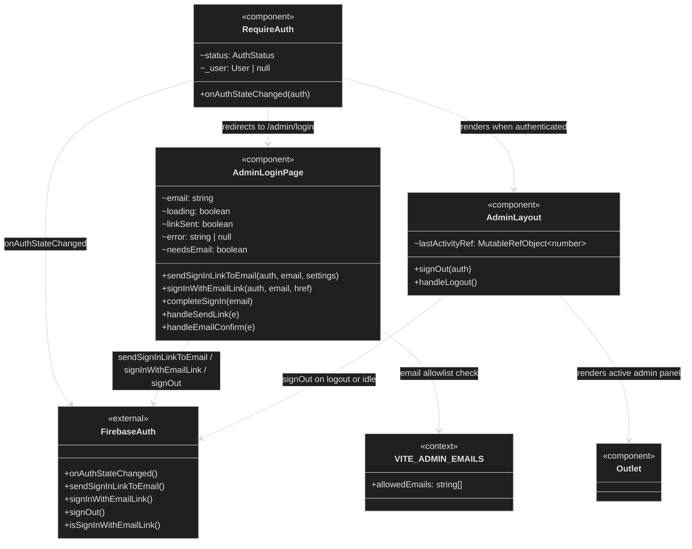

```mermaid
%%{init: {'theme': 'dark'}}%%
classDiagram
    class RequireAuth {
        <<component>>
        ~status: AuthStatus
        ~_user: User | null
        +onAuthStateChanged(auth)
    }

    class AdminLoginPage {
        <<component>>
        ~email: string
        ~loading: boolean
        ~linkSent: boolean
        ~error: string | null
        ~needsEmail: boolean
        +sendSignInLinkToEmail(auth, email, settings)
        +signInWithEmailLink(auth, email, href)
        +completeSignIn(email)
        +handleSendLink(e)
        +handleEmailConfirm(e)
    }

    class AdminLayout {
        <<component>>
        ~lastActivityRef: MutableRefObject~number~
        +signOut(auth)
        +handleLogout()
    }

    class FirebaseAuth {
        <<external>>
        +onAuthStateChanged()
        +sendSignInLinkToEmail()
        +signInWithEmailLink()
        +signOut()
        +isSignInWithEmailLink()
    }

    class VITE_ADMIN_EMAILS {
        <<context>>
        +allowedEmails: string[]
    }

    class Outlet {
        <<component>>
    }

    RequireAuth --> AdminLoginPage : redirects to /admin/login
    RequireAuth --> AdminLayout : renders when authenticated
    AdminLayout --> Outlet : renders active admin panel
    RequireAuth --> FirebaseAuth : onAuthStateChanged
    AdminLoginPage --> FirebaseAuth : sendSignInLinkToEmail / signInWithEmailLink / signOut
    AdminLayout --> FirebaseAuth : signOut on logout or idle
    AdminLoginPage --> VITE_ADMIN_EMAILS : email allowlist check
```
