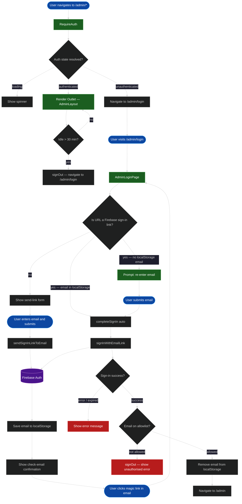

```mermaid
%%{init: {'theme': 'dark', 'themeVariables': {'edgeLabelBackground': '#1e1e2e', 'clusterBkg': '#252535', 'clusterBorder': '#4a4a6a'}}}%%
flowchart TD
    A([User navigates to /admin/*]):::trigger
    B[RequireAuth]:::admin
    C{Auth state resolved?}
    B --> C
    C -->|loading| D[Show spinner]
    C -->|unauthenticated| E[Navigate to /admin/login]
    C -->|authenticated| F[Render Outlet — AdminLayout]:::admin

    F --> G{Idle > 30 min?}
    G -->|yes| H[signOut — navigate to /admin/login]
    G -->|no| F

    A --> B

    E --> I([User visits /admin/login]):::trigger
    I --> J[AdminLoginPage]:::admin
    J --> K{Is URL a Firebase sign-in link?}

    K -->|no| L[Show send-link form]
    K -->|yes — email in localStorage| M[completeSignIn auto]
    K -->|yes — no localStorage email| N[Prompt: re-enter email]:::admin
    N --> O([User submits email]):::trigger
    O --> M

    L --> P([User enters email and submits]):::trigger
    P --> Q[sendSignInLinkToEmail]
    Q --> R[("Firebase Auth")]:::external
    R --> S[Save email to localStorage]
    S --> T[Show check-email confirmation]

    T --> U([User clicks magic link in email]):::trigger
    U --> J

    M --> V[signInWithEmailLink]
    V --> R
    V --> W{Sign-in success?}
    W -->|error / expired| X[Show error message]:::blocked
    W -->|success| Y{Email on allowlist?}
    Y -->|not allowed| Z[signOut — show unauthorised error]:::blocked
    Y -->|allowed| AA[Remove email from localStorage]
    AA --> AB[Navigate to /admin]

    classDef trigger  fill:#0d47a1,stroke:#42a5f5,color:#fff
    classDef db       fill:#bf360c,stroke:#ff8a65,color:#fff
    classDef external fill:#4a148c,stroke:#ce93d8,color:#fff
    classDef admin    fill:#1b5e20,stroke:#81c784,color:#fff
    classDef blocked  fill:#b71c1c,stroke:#ef9a9a,color:#fff
```
