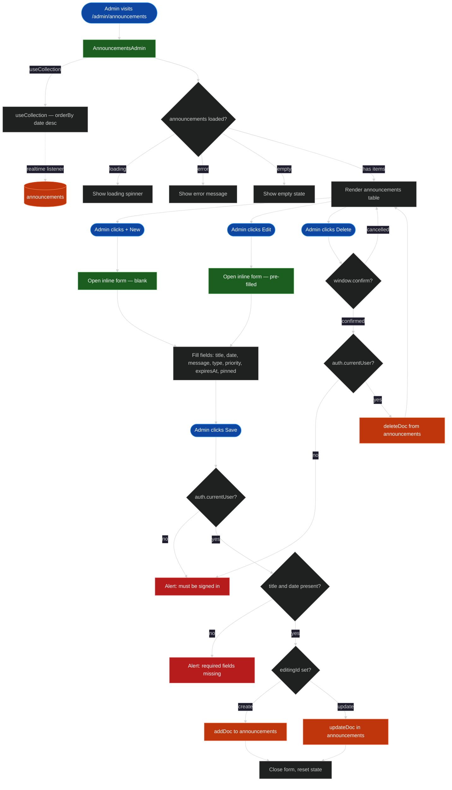

```mermaid
%%{init: {'theme': 'dark', 'themeVariables': {'edgeLabelBackground': '#1e1e2e', 'clusterBkg': '#252535', 'clusterBorder': '#4a4a6a'}}}%%
flowchart TD
    A([Admin visits /admin/announcements]):::trigger
    B[AnnouncementsAdmin]:::admin
    C[useCollection — orderBy date desc]
    D[(announcements)]:::db

    A --> B
    B -->|useCollection| C
    C -.->|realtime listener| D

    B --> E{announcements loaded?}
    E -->|loading| F[Show loading spinner]
    E -->|error| G[Show error message]
    E -->|empty| H[Show empty state]
    E -->|has items| I[Render announcements table]

    I --> J([Admin clicks + New]):::trigger
    I --> K([Admin clicks Edit]):::trigger
    I --> L([Admin clicks Delete]):::trigger

    J --> M[Open inline form — blank]:::admin
    K --> N[Open inline form — pre-filled]:::admin
    M --> O[Fill fields: title, date, message, type, priority, expiresAt, pinned]
    N --> O

    O --> P([Admin clicks Save]):::trigger
    P --> Q{auth.currentUser?}
    Q -->|no| R[Alert: must be signed in]:::blocked
    Q -->|yes| S{title and date present?}
    S -->|no| T[Alert: required fields missing]:::blocked
    S -->|yes| U{editingId set?}
    U -->|create| V[addDoc to announcements]:::db
    U -->|update| W[updateDoc in announcements]:::db
    V --> X[Close form, reset state]
    W --> X

    L --> Y{window.confirm?}
    Y -->|cancelled| I
    Y -->|confirmed| Z{auth.currentUser?}
    Z -->|no| R
    Z -->|yes| AA[deleteDoc from announcements]:::db
    AA --> I

    classDef trigger  fill:#0d47a1,stroke:#42a5f5,color:#fff
    classDef db       fill:#bf360c,stroke:#ff8a65,color:#fff
    classDef external fill:#4a148c,stroke:#ce93d8,color:#fff
    classDef admin    fill:#1b5e20,stroke:#81c784,color:#fff
    classDef blocked  fill:#b71c1c,stroke:#ef9a9a,color:#fff
```
