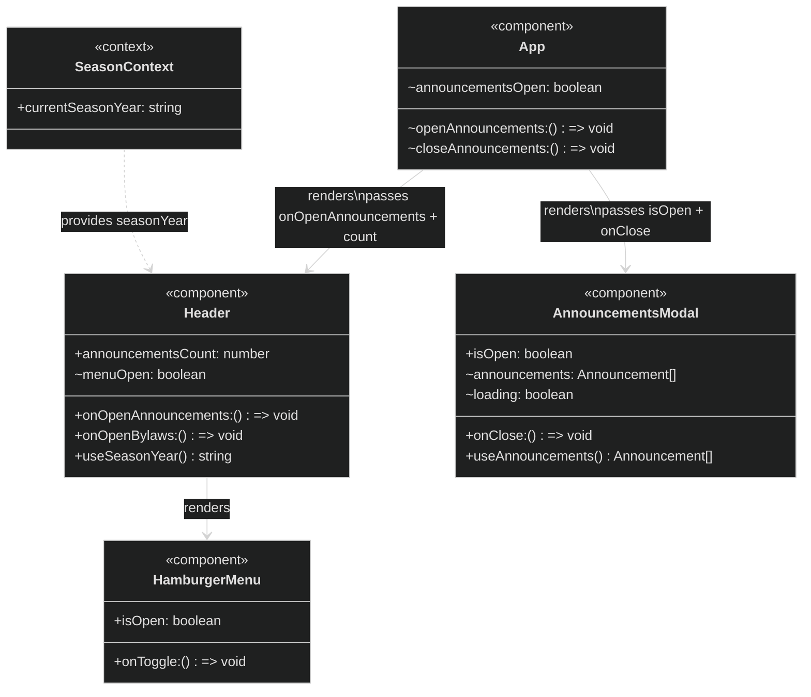

> **Note:** `announcementsCount` is derived by the parent (`App` or the layout that mounts
> `Header`) from the same `useAnnouncements` hook result — the count is passed as a prop
> so `Header` itself does not call the hook. `AnnouncementsModal` calls `useAnnouncements`
> directly for the full announcement list and renders it.
