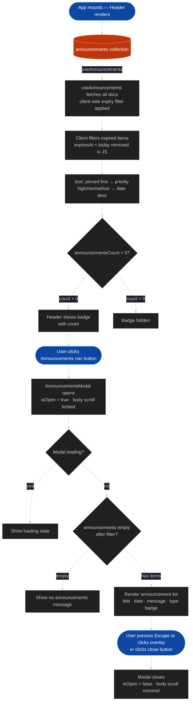

> **Note:** Expiry filtering (`expiresAt IS NULL OR expiresAt >= today`) is intentionally
> done client-side — Firestore cannot express a null-or-date composite filter without a
> fragile index. The collection is expected to stay under 100 documents.
