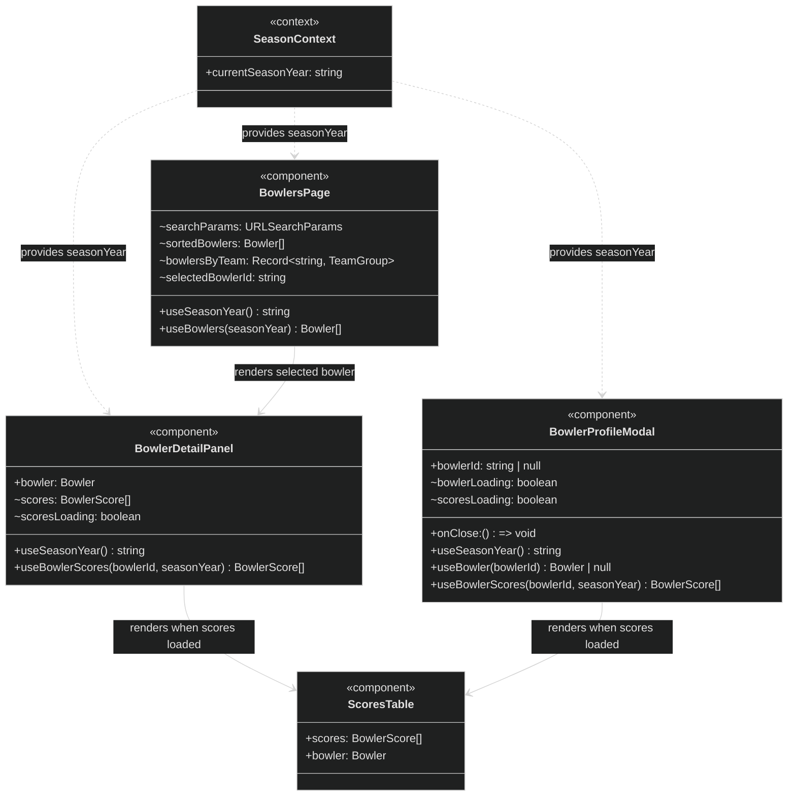

> **Note:** `BowlerProfileModal` is a separate component invoked by `MatchupDetailModal`
> and `HomePage` for drill-through from matchup rows. `BowlersPage` uses an inline
> `BowlerDetailPanel` (not the modal). Both share the same `ScoresTable` sub-component shape
> but each file defines its own local copy.
