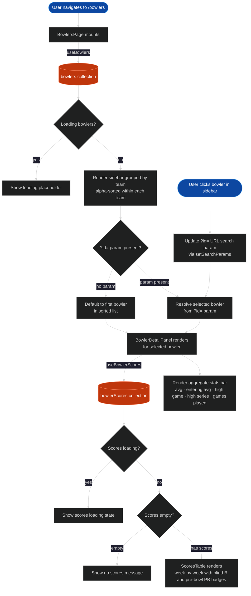

```mermaid
%%{init: {'theme': 'dark', 'themeVariables': {'edgeLabelBackground': '#1e1e2e', 'clusterBkg': '#252535', 'clusterBorder': '#4a4a6a'}}}%%
flowchart TD
    A([User navigates to /bowlers]):::trigger
    B[BowlersPage mounts]
    C[(bowlers collection)]:::db
    D{Loading bowlers?}
    E[Show loading placeholder]
    F[Render sidebar grouped by team\nalpha-sorted within each team]
    G{?id= param present?}
    H[Default to first bowler\nin sorted list]
    I[Resolve selected bowler\nfrom ?id= param]
    J([User clicks bowler in sidebar]):::trigger
    K[Update ?id= URL search param\nvia setSearchParams]
    L[BowlerDetailPanel renders\nfor selected bowler]
    M[(bowlerScores collection)]:::db
    N{Scores loading?}
    O[Show scores loading state]
    P[Render aggregate stats bar\navg · entering avg · high game · high series · games played]
    Q{Scores empty?}
    R[Show no scores message]
    S[ScoresTable renders\nweek-by-week with blind B and pre-bowl PB badges]

    A --> B
    B -->|useBowlers| C
    C --> D
    D -- yes --> E
    D -- no --> F
    F --> G
    G -- no param --> H
    G -- param present --> I
    H --> L
    I --> L
    J --> K
    K --> I
    L -->|useBowlerScores| M
    L --> P
    M --> N
    N -- yes --> O
    N -- no --> Q
    Q -- empty --> R
    Q -- has scores --> S

    classDef trigger  fill:#0d47a1,stroke:#42a5f5,color:#fff
    classDef db       fill:#bf360c,stroke:#ff8a65,color:#fff
    classDef external fill:#4a148c,stroke:#ce93d8,color:#fff
    classDef admin    fill:#1b5e20,stroke:#81c784,color:#fff
    classDef blocked  fill:#b71c1c,stroke:#ef9a9a,color:#fff
```
