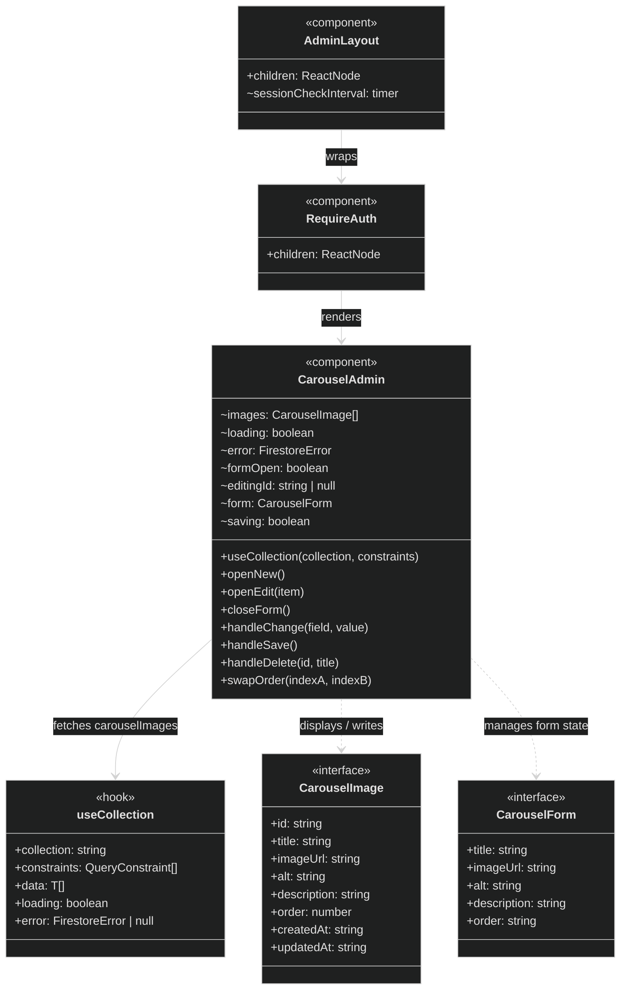

```mermaid
%%{init: {'theme': 'dark'}}%%
classDiagram
    class AdminLayout {
        <<component>>
        +children: ReactNode
        ~sessionCheckInterval: timer
    }

    class RequireAuth {
        <<component>>
        +children: ReactNode
    }

    class CarouselAdmin {
        <<component>>
        ~images: CarouselImage[]
        ~loading: boolean
        ~error: FirestoreError
        ~formOpen: boolean
        ~editingId: string | null
        ~form: CarouselForm
        ~saving: boolean
        +useCollection(collection, constraints)
        +openNew()
        +openEdit(item)
        +closeForm()
        +handleChange(field, value)
        +handleSave()
        +handleDelete(id, title)
        +swapOrder(indexA, indexB)
    }

    class useCollection {
        <<hook>>
        +collection: string
        +constraints: QueryConstraint[]
        +data: T[]
        +loading: boolean
        +error: FirestoreError | null
    }

    class CarouselImage {
        <<interface>>
        +id: string
        +title: string
        +imageUrl: string
        +alt: string
        +description: string
        +order: number
        +createdAt: string
        +updatedAt: string
    }

    class CarouselForm {
        <<interface>>
        +title: string
        +imageUrl: string
        +alt: string
        +description: string
        +order: string
    }

    AdminLayout --> RequireAuth : wraps
    RequireAuth --> CarouselAdmin : renders
    CarouselAdmin --> useCollection : fetches carouselImages
    CarouselAdmin ..> CarouselImage : displays / writes
    CarouselAdmin ..> CarouselForm : manages form state
```
