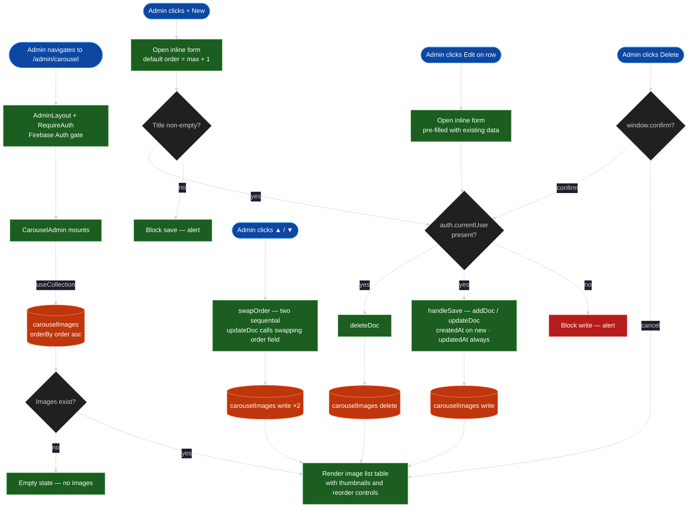

```mermaid
%%{init: {'theme': 'dark', 'themeVariables': {'edgeLabelBackground': '#1e1e2e', 'clusterBkg': '#252535', 'clusterBorder': '#4a4a6a'}}}%%
flowchart TD
    A([Admin navigates to /admin/carousel]):::trigger
    B[AdminLayout + RequireAuth\nFirebase Auth gate]:::admin
    C[CarouselAdmin mounts]:::admin
    D[(carouselImages\norderBy order asc)]:::db
    E{Images exist?}
    F[Render image list table\nwith thumbnails and reorder controls]:::admin
    G[Empty state — no images]:::admin

    H([Admin clicks + New]):::trigger
    I[Open inline form\ndefault order = max + 1]:::admin
    J{Title non-empty?}
    K[Block save — alert]:::admin

    L([Admin clicks Edit on row]):::trigger
    M[Open inline form\npre-filled with existing data]:::admin

    N[handleSave — addDoc / updateDoc\ncreatedAt on new · updatedAt always]:::admin
    O[(carouselImages write)]:::db

    P([Admin clicks ▲ / ▼]):::trigger
    Q[swapOrder — two sequential\nupdateDoc calls swapping order field]:::admin
    R[(carouselImages write ×2)]:::db

    S([Admin clicks Delete]):::trigger
    T{window.confirm?}
    U[deleteDoc]:::admin
    V[(carouselImages delete)]:::db

    W{auth.currentUser\npresent?}
    X[Block write — alert]:::blocked

    A --> B --> C -->|useCollection| D
    D --> E
    E -->|yes| F
    E -->|no| G
    H --> I --> J
    J -->|no| K
    J -->|yes| W
    L --> M --> W
    W -->|no| X
    W -->|yes| N --> O --> F
    P --> Q --> R --> F
    S --> T
    T -->|cancel| F
    T -->|confirm| W
    W -->|yes| U --> V --> F

    classDef trigger  fill:#0d47a1,stroke:#42a5f5,color:#fff
    classDef db       fill:#bf360c,stroke:#ff8a65,color:#fff
    classDef external fill:#4a148c,stroke:#ce93d8,color:#fff
    classDef admin    fill:#1b5e20,stroke:#81c784,color:#fff
    classDef blocked  fill:#b71c1c,stroke:#ef9a9a,color:#fff
```
