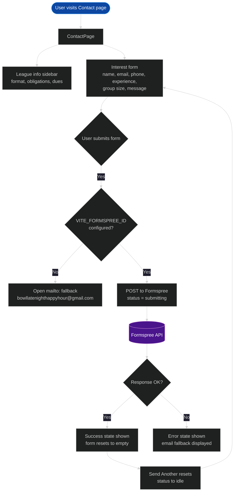

> **STALE** — This diagram reflects the old Formspree form flow. Regenerate with `/generate-diagrams` after the refactor is complete.

```mermaid
%%{init: {'theme': 'dark', 'themeVariables': {'edgeLabelBackground': '#1e1e2e', 'clusterBkg': '#252535', 'clusterBorder': '#4a4a6a'}}}%%
flowchart TD
    A([User visits Contact page]):::trigger
    B[ContactPage]
    C[League info sidebar\nformat, obligations, dues]
    D[Interest form\nname, email, phone, experience,\ngroup size, message]
    E{User submits form}
    F{VITE_FORMSPREE_ID\nconfigured?}
    G[Open mailto: fallback\nbowllatenighthappyhour@gmail.com]
    H[POST to Formspree\nstatus = submitting]
    I[("Formspree API")]:::external
    J{Response OK?}
    K[Success state shown\nform resets to empty]
    L[Error state shown\nemail fallback displayed]
    M[Send Another resets\nstatus to idle]

    A --> B
    B --> C
    B --> D
    D --> E
    E -- Yes --> F
    F -- No --> G
    F -- Yes --> H
    H --> I
    I --> J
    J -- Yes --> K
    J -- No --> L
    K --> M
    M --> D

    classDef trigger  fill:#0d47a1,stroke:#42a5f5,color:#fff
    classDef db       fill:#bf360c,stroke:#ff8a65,color:#fff
    classDef external fill:#4a148c,stroke:#ce93d8,color:#fff
    classDef admin    fill:#1b5e20,stroke:#81c784,color:#fff
    classDef blocked  fill:#b71c1c,stroke:#ef9a9a,color:#fff
```
