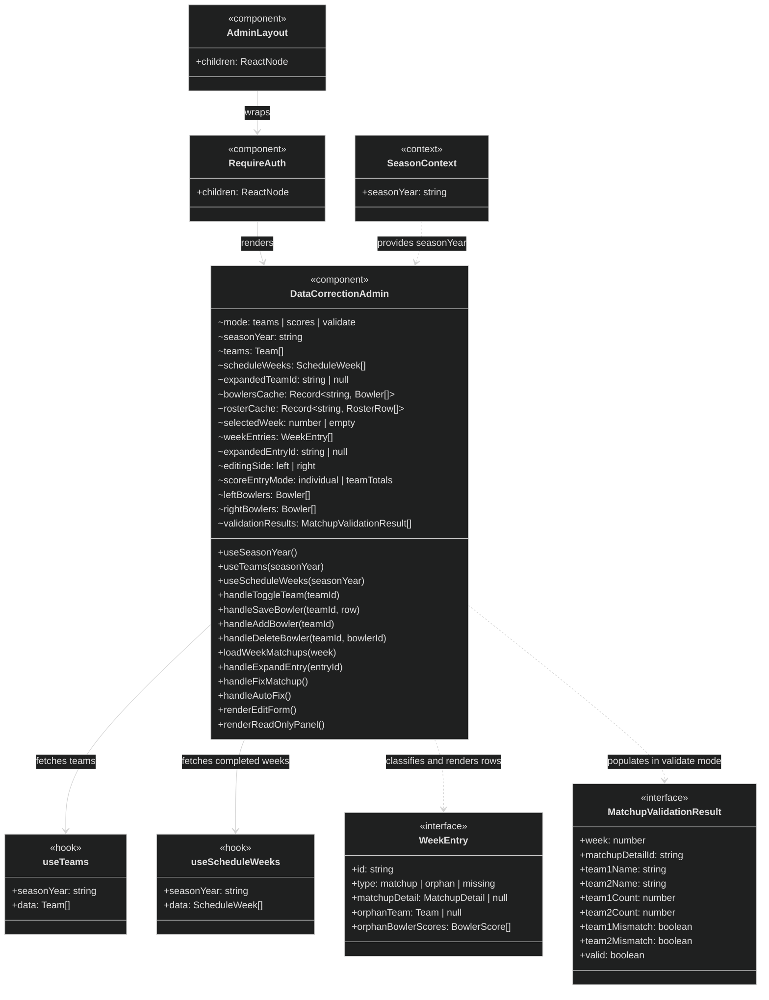

```mermaid
%%{init: {'theme': 'dark'}}%%
classDiagram
    class AdminLayout {
        <<component>>
        +children: ReactNode
    }

    class RequireAuth {
        <<component>>
        +children: ReactNode
    }

    class DataCorrectionAdmin {
        <<component>>
        ~mode: teams | scores | validate
        ~seasonYear: string
        ~teams: Team[]
        ~scheduleWeeks: ScheduleWeek[]
        ~expandedTeamId: string | null
        ~bowlersCache: Record~string, Bowler[]~
        ~rosterCache: Record~string, RosterRow[]~
        ~selectedWeek: number | empty
        ~weekEntries: WeekEntry[]
        ~expandedEntryId: string | null
        ~editingSide: left | right
        ~scoreEntryMode: individual | teamTotals
        ~leftBowlers: Bowler[]
        ~rightBowlers: Bowler[]
        ~validationResults: MatchupValidationResult[]
        +useSeasonYear()
        +useTeams(seasonYear)
        +useScheduleWeeks(seasonYear)
        +handleToggleTeam(teamId)
        +handleSaveBowler(teamId, row)
        +handleAddBowler(teamId)
        +handleDeleteBowler(teamId, bowlerId)
        +loadWeekMatchups(week)
        +handleExpandEntry(entryId)
        +handleFixMatchup()
        +handleAutoFix()
        +renderEditForm()
        +renderReadOnlyPanel()
    }

    class SeasonContext {
        <<context>>
        +seasonYear: string
    }

    class useTeams {
        <<hook>>
        +seasonYear: string
        +data: Team[]
    }

    class useScheduleWeeks {
        <<hook>>
        +seasonYear: string
        +data: ScheduleWeek[]
    }

    class WeekEntry {
        <<interface>>
        +id: string
        +type: matchup | orphan | missing
        +matchupDetail: MatchupDetail | null
        +orphanTeam: Team | null
        +orphanBowlerScores: BowlerScore[]
    }

    class MatchupValidationResult {
        <<interface>>
        +week: number
        +matchupDetailId: string
        +team1Name: string
        +team2Name: string
        +team1Count: number
        +team2Count: number
        +team1Mismatch: boolean
        +team2Mismatch: boolean
        +valid: boolean
    }

    AdminLayout --> RequireAuth : wraps
    RequireAuth --> DataCorrectionAdmin : renders
    SeasonContext ..> DataCorrectionAdmin : provides seasonYear
    DataCorrectionAdmin --> useTeams : fetches teams
    DataCorrectionAdmin --> useScheduleWeeks : fetches completed weeks
    DataCorrectionAdmin ..> WeekEntry : classifies and renders rows
    DataCorrectionAdmin ..> MatchupValidationResult : populates in validate mode
```
