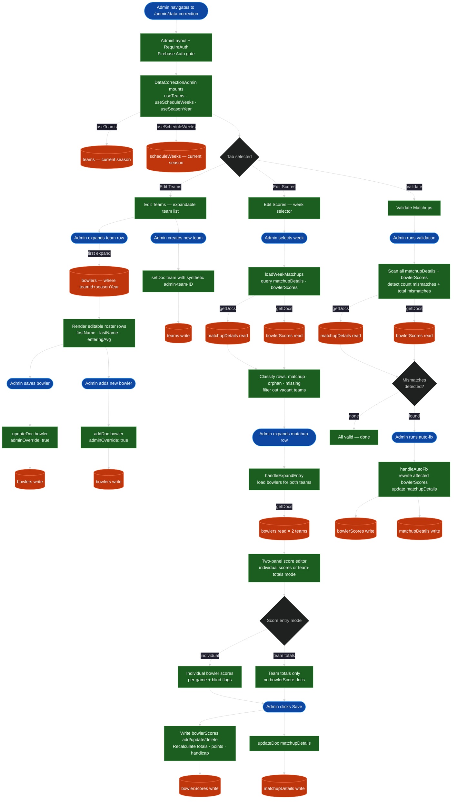

```mermaid
%%{init: {'theme': 'dark', 'themeVariables': {'edgeLabelBackground': '#1e1e2e', 'clusterBkg': '#252535', 'clusterBorder': '#4a4a6a'}}}%%
flowchart TD
    A([Admin navigates to /admin/data-correction]):::trigger
    B[AdminLayout + RequireAuth\nFirebase Auth gate]:::admin
    C[DataCorrectionAdmin mounts\nuseTeams · useScheduleWeeks · useSeasonYear]:::admin
    D[(teams — current season)]:::db
    E[(scheduleWeeks — current season)]:::db

    F{Tab selected}

    %% ── Edit Teams ──────────────────────────────────────
    G[Edit Teams — expandable team list]:::admin
    H([Admin expands team row]):::trigger
    I[(bowlers — where teamId+seasonYear)]:::db
    J[Render editable roster rows\nfirstName · lastName · enteringAvg]:::admin
    K([Admin saves bowler]):::trigger
    L[updateDoc bowler\nadminOverride: true]:::admin
    M[(bowlers write)]:::db
    N([Admin adds new bowler]):::trigger
    O[addDoc bowler\nadminOverride: true]:::admin
    P[(bowlers write)]:::db
    Q([Admin creates new team]):::trigger
    R[setDoc team with synthetic admin-team-ID]:::admin
    S[(teams write)]:::db

    %% ── Edit Scores ─────────────────────────────────────
    T[Edit Scores — week selector]:::admin
    U([Admin selects week]):::trigger
    V[loadWeekMatchups\nquery matchupDetails · bowlerScores]:::admin
    W[(matchupDetails read)]:::db
    X[(bowlerScores read)]:::db
    Y[Classify rows: matchup · orphan · missing\nfilter out vacant teams]:::admin
    Z([Admin expands matchup row]):::trigger
    AA[handleExpandEntry\nload bowlers for both teams]:::admin
    AB[(bowlers read × 2 teams)]:::db
    AC[Two-panel score editor\nindividual scores or team-totals mode]:::admin
    AD{Score entry mode}
    AE[Individual bowler scores\nper-game + blind flags]:::admin
    AF[Team totals only\nno bowlerScore docs]:::admin
    AG([Admin clicks Save]):::trigger
    AH[Write bowlerScores add/update/delete\nRecalculate totals · points · handicap]:::admin
    AI[updateDoc matchupDetails]:::admin
    AJ[(bowlerScores write)]:::db
    AK[(matchupDetails write)]:::db

    %% ── Validate ─────────────────────────────────────────
    AL[Validate Matchups]:::admin
    AM([Admin runs validation]):::trigger
    AN[Scan all matchupDetails + bowlerScores\ndetect count mismatches + total mismatches]:::admin
    AO[(matchupDetails read)]:::db
    AP[(bowlerScores read)]:::db
    AQ{Mismatches\ndetected?}
    AR[All valid — done]:::admin
    AS([Admin runs auto-fix]):::trigger
    AT[handleAutoFix\nrewrite affected bowlerScores\nupdate matchupDetails]:::admin
    AU[(bowlerScores write)]:::db
    AV[(matchupDetails write)]:::db

    A --> B --> C
    C -->|useTeams| D
    C -->|useScheduleWeeks| E
    C --> F

    F -->|Edit Teams| G
    G --> H -->|first expand| I --> J
    J --> K --> L --> M
    J --> N --> O --> P
    G --> Q --> R --> S

    F -->|Edit Scores| T
    T --> U --> V
    V -->|getDocs| W
    V -->|getDocs| X
    W --> Y
    X --> Y
    Y --> Z --> AA -->|getDocs| AB --> AC
    AC --> AD
    AD -->|individual| AE --> AG
    AD -->|team totals| AF --> AG
    AG --> AH --> AJ
    AG --> AI --> AK

    F -->|Validate| AL
    AL --> AM --> AN
    AN -->|getDocs| AO
    AN -->|getDocs| AP
    AO --> AQ
    AP --> AQ
    AQ -->|none| AR
    AQ -->|found| AS --> AT
    AT --> AU
    AT --> AV

    classDef trigger  fill:#0d47a1,stroke:#42a5f5,color:#fff
    classDef db       fill:#bf360c,stroke:#ff8a65,color:#fff
    classDef external fill:#4a148c,stroke:#ce93d8,color:#fff
    classDef admin    fill:#1b5e20,stroke:#81c784,color:#fff
    classDef blocked  fill:#b71c1c,stroke:#ef9a9a,color:#fff
```
