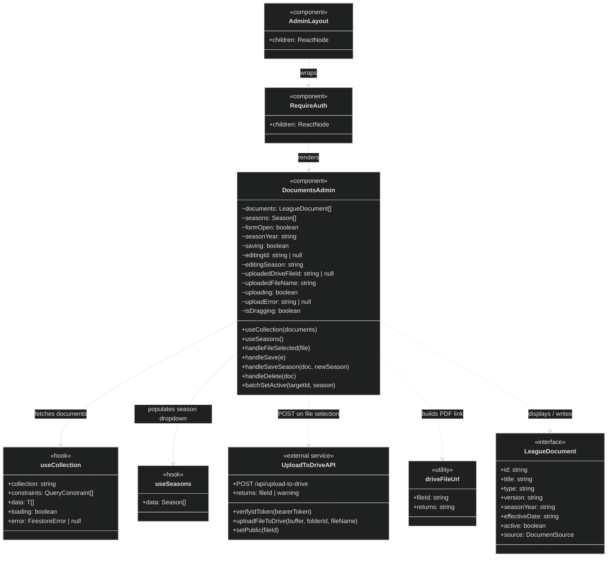

```mermaid
%%{init: {'theme': 'dark'}}%%
classDiagram
    class AdminLayout {
        <<component>>
        +children: ReactNode
    }

    class RequireAuth {
        <<component>>
        +children: ReactNode
    }

    class DocumentsAdmin {
        <<component>>
        ~documents: LeagueDocument[]
        ~seasons: Season[]
        ~formOpen: boolean
        ~seasonYear: string
        ~saving: boolean
        ~editingId: string | null
        ~editingSeason: string
        ~uploadedDriveFileId: string | null
        ~uploadedFileName: string
        ~uploading: boolean
        ~uploadError: string | null
        ~isDragging: boolean
        +useCollection(documents)
        +useSeasons()
        +handleFileSelected(file)
        +handleSave(e)
        +handleSaveSeason(doc, newSeason)
        +handleDelete(doc)
        +batchSetActive(targetId, season)
    }

    class useCollection {
        <<hook>>
        +collection: string
        +constraints: QueryConstraint[]
        +data: T[]
        +loading: boolean
        +error: FirestoreError | null
    }

    class useSeasons {
        <<hook>>
        +data: Season[]
    }

    class UploadToDriveAPI {
        <<external service>>
        +POST /api/upload-to-drive
        +verifyIdToken(bearerToken)
        +uploadFileToDrive(buffer, folderId, fileName)
        +setPublic(fileId)
        +returns: fileId | warning
    }

    class driveFileUrl {
        <<utility>>
        +fileId: string
        +returns: string
    }

    class LeagueDocument {
        <<interface>>
        +id: string
        +title: string
        +type: string
        +version: string
        +seasonYear: string
        +effectiveDate: string
        +active: boolean
        +source: DocumentSource
    }

    AdminLayout --> RequireAuth : wraps
    RequireAuth --> DocumentsAdmin : renders
    DocumentsAdmin --> useCollection : fetches documents
    DocumentsAdmin --> useSeasons : populates season dropdown
    DocumentsAdmin ..> UploadToDriveAPI : POST on file selection
    DocumentsAdmin ..> driveFileUrl : builds PDF link
    DocumentsAdmin ..> LeagueDocument : displays / writes
```
