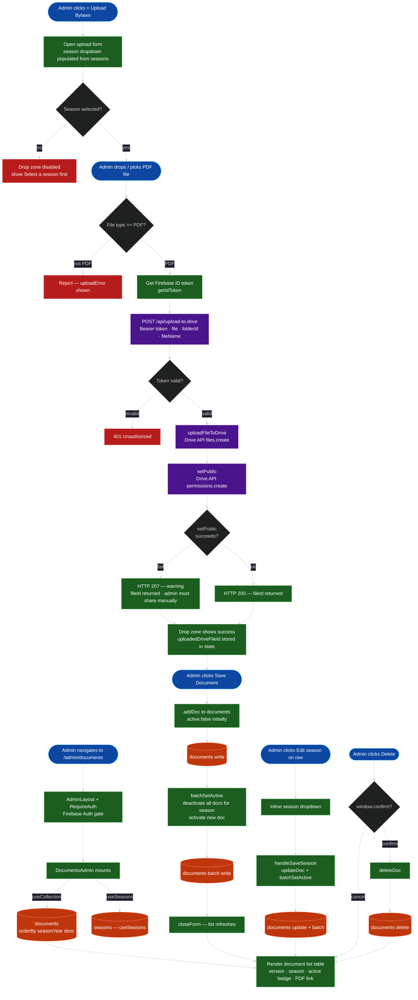

```mermaid
%%{init: {'theme': 'dark', 'themeVariables': {'edgeLabelBackground': '#1e1e2e', 'clusterBkg': '#252535', 'clusterBorder': '#4a4a6a'}}}%%
flowchart TD
    A([Admin navigates to /admin/documents]):::trigger
    B[AdminLayout + RequireAuth\nFirebase Auth gate]:::admin
    C[DocumentsAdmin mounts]:::admin
    D[(documents\norderBy seasonYear desc)]:::db
    E[(seasons — useSeasons)]:::db
    F[Render document list table\nversion · season · active badge · PDF link]:::admin

    G([Admin clicks + Upload Bylaws]):::trigger
    H[Open upload form\nseason dropdown populated from seasons]:::admin
    I{Season selected?}
    J[Drop zone disabled\nshow Select a season first]:::blocked

    K([Admin drops / picks PDF file]):::trigger
    L{File type == PDF?}
    M[Reject — uploadError shown]:::blocked
    N[Get Firebase ID token\ngetIdToken]:::admin
    O[POST /api/upload-to-drive\nBearer token · file · folderId · fileName]:::external
    P{Token valid?}
    Q[401 Unauthorized]:::blocked
    R[uploadFileToDrive\nDrive API files.create]:::external
    S[setPublic\nDrive API permissions.create]:::external
    T{setPublic\nsucceeds?}
    U[HTTP 207 — warning\nfileId returned · admin must share manually]:::admin
    V[HTTP 200 — fileId returned]:::admin
    W[Drop zone shows success\nuploadedDriveFileId stored in state]:::admin

    X([Admin clicks Save Document]):::trigger
    Y[addDoc to documents\nactive:false initially]:::admin
    Z[(documents write)]:::db
    AA[batchSetActive\ndeactivate all docs for season\nactivate new doc]:::admin
    AB[(documents batch write)]:::db
    AC[closeForm — list refreshes]:::admin

    AD([Admin clicks Edit season on row]):::trigger
    AE[Inline season dropdown]:::admin
    AF[handleSaveSeason\nupdateDoc + batchSetActive]:::admin
    AG[(documents update + batch)]:::db

    AH([Admin clicks Delete]):::trigger
    AI{window.confirm?}
    AJ[deleteDoc]:::admin
    AK[(documents delete)]:::db

    A --> B --> C
    C -->|useCollection| D
    C -->|useSeasons| E
    D --> F
    G --> H --> I
    I -->|no| J
    I -->|yes| K
    K --> L
    L -->|not PDF| M
    L -->|PDF| N --> O --> P
    P -->|invalid| Q:::blocked
    P -->|valid| R --> S --> T
    T -->|fail| U --> W
    T -->|ok| V --> W
    W --> X --> Y --> Z --> AA --> AB --> AC --> F
    AD --> AE --> AF --> AG --> F
    AH --> AI
    AI -->|cancel| F
    AI -->|confirm| AJ --> AK --> F

    classDef trigger  fill:#0d47a1,stroke:#42a5f5,color:#fff
    classDef db       fill:#bf360c,stroke:#ff8a65,color:#fff
    classDef external fill:#4a148c,stroke:#ce93d8,color:#fff
    classDef admin    fill:#1b5e20,stroke:#81c784,color:#fff
    classDef blocked  fill:#b71c1c,stroke:#ef9a9a,color:#fff
```
