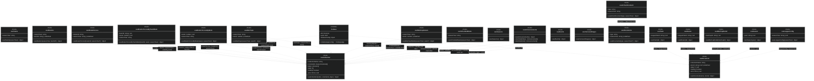

```mermaid
%%{init: {'theme': 'dark'}}%%
classDiagram
    class firebase {
        <<module>>
        +db: Firestore
        +auth: Auth
        -firebaseConfig: object
        +initializeApp(config): FirebaseApp
    }

    class useCollection {
        <<hook>>
        +collectionName: string
        +constraints: QueryConstraint[]
        +deps: unknown[]
        ~data: T[]
        ~loading: boolean
        ~error: Error | null
        +useCollection(name, constraints, deps) object
    }

    class useDocument {
        <<hook>>
        +collectionName: string
        +docId: string | null | undefined
        ~data: T | null
        ~loading: boolean
        ~error: Error | null
        +useDocument(name, docId) object
    }

    class useTeams {
        <<hook>>
        +seasonYear: string
        +useTeams(seasonYear) object
    }

    class useTeam {
        <<hook>>
        +leaguePalsId: string | null
        +useTeam(id) object
    }

    class useBowlers {
        <<hook>>
        +seasonYear: string
        +teamId: string | undefined
        +useBowlers(seasonYear, teamId?) object
    }

    class useBowler {
        <<hook>>
        +leaguePalsId: string | null
        +useBowler(id) object
    }

    class useBowlerScores {
        <<hook>>
        +bowlerId: string
        +seasonYear: string | undefined
        +useBowlerScores(bowlerId, seasonYear?) object
    }

    class useBowlerScoresByTeamWeek {
        <<hook>>
        +teamId: string | null
        +week: number | null
        +seasonYear: string
        +useBowlerScoresByTeamWeek(teamId, week, seasonYear) object
    }

    class useBowlerScoresByWeek {
        <<hook>>
        +week: number | null
        +seasonYear: string
        +useBowlerScoresByWeek(week, seasonYear) object
    }

    class useMatchups {
        <<hook>>
        +seasonYear: string
        +week: number | undefined
        +useMatchups(seasonYear, week?) object
    }

    class useMatchupDetails {
        <<hook>>
        +seasonYear: string
        +week: number | undefined
        +useMatchupDetails(seasonYear, week?) object
    }

    class useMatchupDetail {
        <<hook>>
        +matchupId: string | null
        +useMatchupDetail(matchupId) object
    }

    class useScheduleWeeks {
        <<hook>>
        +seasonYear: string
        +useScheduleWeeks(seasonYear) object
    }

    class useSeasons {
        <<hook>>
        +useSeasons() object
    }

    class useSeason {
        <<hook>>
        +year: string | null
        +useSeason(year) object
    }

    class useLeagueConfig {
        <<hook>>
        +seasonYear: string | null
        +useLeagueConfig(seasonYear) object
    }

    class useAnnouncements {
        <<hook>>
        +useAnnouncements() object
        -clientSideFilter() Announcement[]
        -clientSideSort() Announcement[]
    }

    class useEvents {
        <<hook>>
        +useEvents() object
    }

    class useCarouselImages {
        <<hook>>
        +useCarouselImages() object
    }

    class useDocuments {
        <<hook>>
        +type: string
        +seasonYear: string | undefined
        +useDocuments(type, seasonYear?) object
    }

    class useActiveDocument {
        <<hook>>
        +type: string
        +seasonYear: string
        +useActiveDocument(type, seasonYear) object
    }

    %% Layer 1: Firebase init
    firebase --> useCollection : provides db
    firebase --> useDocument : provides db

    %% Layer 2: Domain hooks → generic hooks
    useTeams --> useCollection : teams / seasonYear + orderBy points
    useTeam --> useDocument : teams / leaguePalsId
    useBowlers --> useCollection : bowlers / seasonYear [+ teamId]
    useBowler --> useDocument : bowlers / leaguePalsId
    useBowlerScores --> useCollection : bowlerScores / bowlerId [+ seasonYear]
    useBowlerScoresByTeamWeek --> useCollection : bowlerScores / sentinel or teamId+week
    useBowlerScoresByWeek --> useCollection : bowlerScores / sentinel or seasonYear+week
    useMatchups --> useCollection : matchups / seasonYear [+ week]
    useMatchupDetails --> useCollection : matchupDetails / seasonYear [+ week]
    useMatchupDetail --> useDocument : matchupDetails / matchupId
    useScheduleWeeks --> useCollection : scheduleWeeks / seasonYear + orderBy date
    useSeasons --> useCollection : seasons / orderBy year desc
    useSeason --> useDocument : seasons / year
    useLeagueConfig --> useDocument : leagueConfig / seasonYear
    useAnnouncements --> useCollection : announcements / all then client-filter
    useEvents --> useCollection : events / orderBy date asc
    useCarouselImages --> useCollection : carouselImages / orderBy order asc
    useDocuments --> useCollection : documents / type + active
    useActiveDocument --> useDocuments : delegates + takes first result
```
