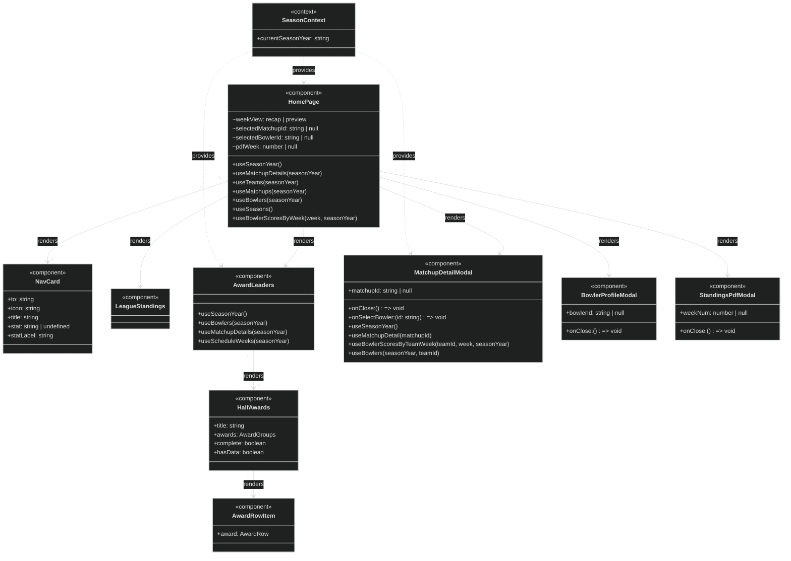

```mermaid
%%{init: {'theme': 'dark'}}%%
classDiagram
    class SeasonContext {
        <<context>>
        +currentSeasonYear: string
    }

    class HomePage {
        <<component>>
        ~weekView: recap | preview
        ~selectedMatchupId: string | null
        ~selectedBowlerId: string | null
        ~pdfWeek: number | null
        +useSeasonYear()
        +useMatchupDetails(seasonYear)
        +useTeams(seasonYear)
        +useMatchups(seasonYear)
        +useBowlers(seasonYear)
        +useSeasons()
        +useBowlerScoresByWeek(week, seasonYear)
    }

    class NavCard {
        <<component>>
        +to: string
        +icon: string
        +title: string
        +stat: string | undefined
        +statLabel: string
    }

    class LeagueStandings {
        <<component>>
    }

    class AwardLeaders {
        <<component>>
        +useSeasonYear()
        +useBowlers(seasonYear)
        +useMatchupDetails(seasonYear)
        +useScheduleWeeks(seasonYear)
    }

    class HalfAwards {
        <<component>>
        +title: string
        +awards: AwardGroups
        +complete: boolean
        +hasData: boolean
    }

    class AwardRowItem {
        <<component>>
        +award: AwardRow
    }

    class MatchupDetailModal {
        <<component>>
        +matchupId: string | null
        +onClose: () => void
        +onSelectBowler: (id: string) => void
        +useSeasonYear()
        +useMatchupDetail(matchupId)
        +useBowlerScoresByTeamWeek(teamId, week, seasonYear)
        +useBowlers(seasonYear, teamId)
    }

    class BowlerProfileModal {
        <<component>>
        +bowlerId: string | null
        +onClose: () => void
    }

    class StandingsPdfModal {
        <<component>>
        +weekNum: number | null
        +onClose: () => void
    }

    SeasonContext ..> HomePage : provides
    SeasonContext ..> AwardLeaders : provides
    SeasonContext ..> MatchupDetailModal : provides

    HomePage "1" --> "5" NavCard : renders
    HomePage --> LeagueStandings : renders
    HomePage --> AwardLeaders : renders
    HomePage --> MatchupDetailModal : renders
    HomePage --> BowlerProfileModal : renders
    HomePage --> StandingsPdfModal : renders

    AwardLeaders "1" --> "2" HalfAwards : renders
    HalfAwards "1" --> "n" AwardRowItem : renders
```
