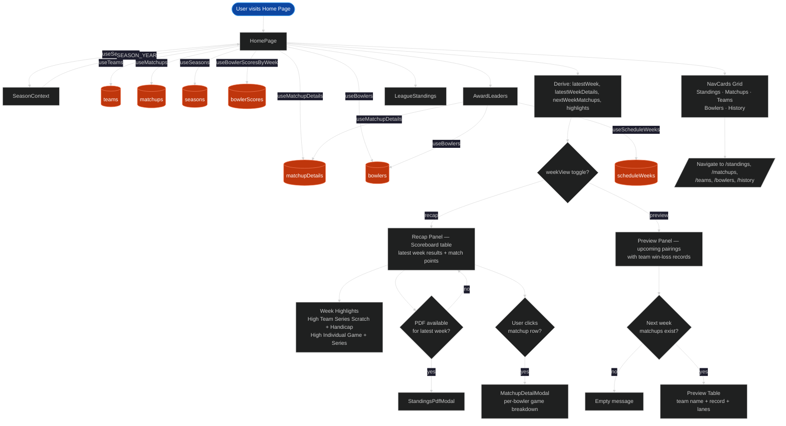

```mermaid
%%{init: {'theme': 'dark', 'themeVariables': {'edgeLabelBackground': '#1e1e2e', 'clusterBkg': '#252535', 'clusterBorder': '#4a4a6a'}}}%%
flowchart TD
    USER([User visits Home Page]):::trigger

    USER --> HP[HomePage]
    HP -->|useSeasonYear| SC[SeasonContext]
    SC -->|SEASON_YEAR| HP

    HP -->|useMatchupDetails| MDD[(matchupDetails)]:::db
    HP -->|useTeams| TDB[(teams)]:::db
    HP -->|useMatchups| MDB[(matchups)]:::db
    HP -->|useBowlers| BDB[(bowlers)]:::db
    HP -->|useSeasons| SDB[(seasons)]:::db
    HP -->|useBowlerScoresByWeek| BSDB[(bowlerScores)]:::db

    HP --> DERIV[Derive: latestWeek, latestWeekDetails, nextWeekMatchups, highlights]

    DERIV --> TABBAR{weekView toggle?}

    TABBAR -->|recap| RECAP[Recap Panel — Scoreboard table\nlatest week results + match points]
    TABBAR -->|preview| PREVIEW[Preview Panel — upcoming pairings\nwith team win-loss records]

    RECAP --> HIGHLIGHTS[Week Highlights\nHigh Team Series Scratch + Handicap\nHigh Individual Game + Series]
    RECAP --> PDFBTN{PDF available\nfor latest week?}
    PDFBTN -->|yes| PDFMODAL[StandingsPdfModal]
    PDFBTN -->|no| RECAP

    RECAP --> CLICKROW{User clicks\nmatchup row?}
    CLICKROW -->|yes| DETAILMODAL[MatchupDetailModal\nper-bowler game breakdown]

    PREVIEW --> EMPTY{Next week\nmatchups exist?}
    EMPTY -->|no| EMPTYMSG[Empty message]
    EMPTY -->|yes| PREVIEWTABLE[Preview Table\nteam name + record + lanes]

    HP --> NAVCARDS[NavCards Grid\nStandings · Matchups · Teams\nBowlers · History]

    HP --> STANDINGSECT[LeagueStandings]
    HP --> AWARDSECT[AwardLeaders]

    AWARDSECT -->|useBowlers| BDB
    AWARDSECT -->|useMatchupDetails| MDD
    AWARDSECT -->|useScheduleWeeks| SWDB[(scheduleWeeks)]:::db

    NAVCARDS --> NAV[/Navigate to /standings, /matchups,\n/teams, /bowlers, /history/]

    classDef trigger  fill:#0d47a1,stroke:#42a5f5,color:#fff
    classDef db       fill:#bf360c,stroke:#ff8a65,color:#fff
    classDef external fill:#4a148c,stroke:#ce93d8,color:#fff
    classDef admin    fill:#1b5e20,stroke:#81c784,color:#fff
    classDef blocked  fill:#b71c1c,stroke:#ef9a9a,color:#fff
```
