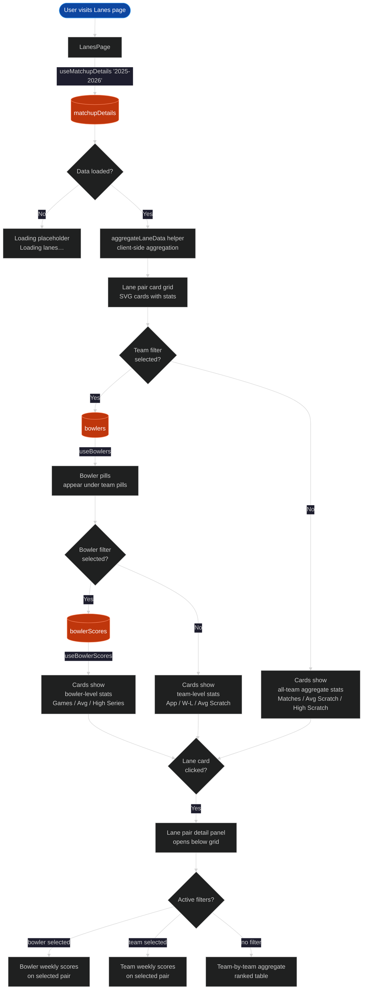

```mermaid
%%{init: {'theme': 'dark', 'themeVariables': {'edgeLabelBackground': '#1e1e2e', 'clusterBkg': '#252535', 'clusterBorder': '#4a4a6a'}}}%%
flowchart TD
    A([User visits Lanes page]):::trigger
    B[LanesPage]
    C[(matchupDetails)]:::db
    D{Data loaded?}
    E[Loading placeholder\nLoading lanes…]
    F[aggregateLaneData helper\nclient-side aggregation]
    G[Lane pair card grid\nSVG cards with stats]
    H{Team filter\nselected?}
    I[(bowlers)]:::db
    J[Bowler pills\nappear under team pills]
    K{Bowler filter\nselected?}
    L[(bowlerScores)]:::db
    M[Cards show\nbowler-level stats\nGames / Avg / High Series]
    N[Cards show\nteam-level stats\nApp / W-L / Avg Scratch]
    O[Cards show\nall-team aggregate stats\nMatches / Avg Scratch / High Scratch]
    P{Lane card\nclicked?}
    Q[Lane pair detail panel\nopens below grid]
    R{Active filters?}
    S[Bowler weekly scores\non selected pair]
    T[Team weekly scores\non selected pair]
    U[Team-by-team aggregate\nranked table]

    A --> B
    B -->|useMatchupDetails '2025-2026'| C
    C --> D
    D -- No --> E
    D -- Yes --> F
    F --> G
    G --> H
    H -- Yes --> I
    I -->|useBowlers| J
    J --> K
    K -- Yes --> L
    L -->|useBowlerScores| M
    K -- No --> N
    H -- No --> O
    M --> P
    N --> P
    O --> P
    P -- Yes --> Q
    Q --> R
    R -- bowler selected --> S
    R -- team selected --> T
    R -- no filter --> U

    classDef trigger  fill:#0d47a1,stroke:#42a5f5,color:#fff
    classDef db       fill:#bf360c,stroke:#ff8a65,color:#fff
    classDef external fill:#4a148c,stroke:#ce93d8,color:#fff
    classDef admin    fill:#1b5e20,stroke:#81c784,color:#fff
    classDef blocked  fill:#b71c1c,stroke:#ef9a9a,color:#fff
```
