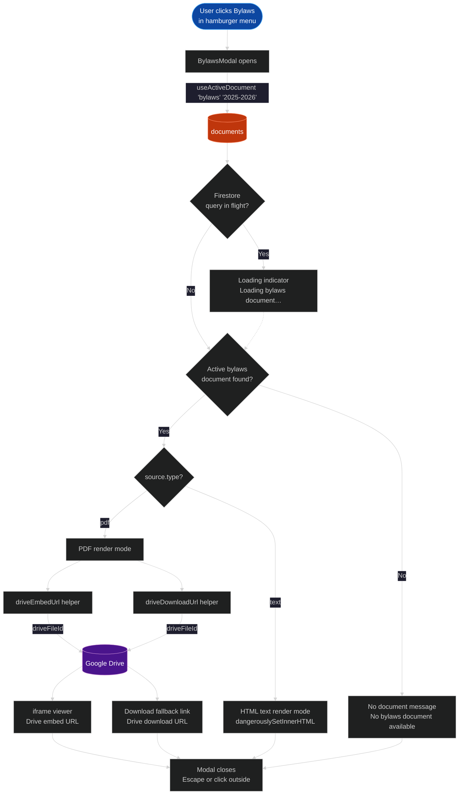

```mermaid
%%{init: {'theme': 'dark', 'themeVariables': {'edgeLabelBackground': '#1e1e2e', 'clusterBkg': '#252535', 'clusterBorder': '#4a4a6a'}}}%%
flowchart TD
    A([User clicks Bylaws\nin hamburger menu]):::trigger
    B[BylawsModal opens]
    C[(documents)]:::db
    D{Firestore\nquery in flight?}
    E[Loading indicator\nLoading bylaws document…]
    F{Active bylaws\ndocument found?}
    G[No document message\nNo bylaws document available]
    H{source.type?}
    I[PDF render mode]
    J[driveEmbedUrl helper]
    K[driveDownloadUrl helper]
    L[("Google Drive")]:::external
    M[iframe viewer\nDrive embed URL]
    N[Download fallback link\nDrive download URL]
    O[HTML text render mode\ndangerouslySetInnerHTML]
    P[Modal closes\nEscape or click outside]

    A --> B
    B -->|useActiveDocument 'bylaws' '2025-2026'| C
    C --> D
    D -- Yes --> E
    D -- No --> F
    F -- No --> G
    F -- Yes --> H
    H -- pdf --> I
    I --> J
    I --> K
    J -->|driveFileId| L
    K -->|driveFileId| L
    L --> M
    L --> N
    H -- text --> O
    M --> P
    N --> P
    O --> P
    G --> P
    E -.-> F

    classDef trigger  fill:#0d47a1,stroke:#42a5f5,color:#fff
    classDef db       fill:#bf360c,stroke:#ff8a65,color:#fff
    classDef external fill:#4a148c,stroke:#ce93d8,color:#fff
    classDef admin    fill:#1b5e20,stroke:#81c784,color:#fff
    classDef blocked  fill:#b71c1c,stroke:#ef9a9a,color:#fff
```
