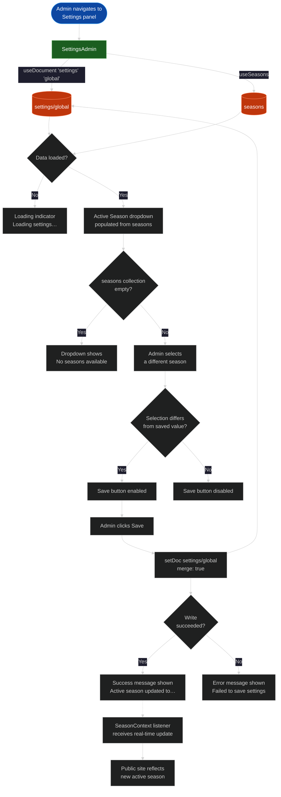

```mermaid
%%{init: {'theme': 'dark', 'themeVariables': {'edgeLabelBackground': '#1e1e2e', 'clusterBkg': '#252535', 'clusterBorder': '#4a4a6a'}}}%%
flowchart TD
    A([Admin navigates to\nSettings panel]):::trigger
    B[SettingsAdmin]:::admin
    C[(settings/global)]:::db
    D[(seasons)]:::db
    E{Data loaded?}
    F[Loading indicator\nLoading settings…]
    G[Active Season dropdown\npopulated from seasons]
    H{seasons collection\nempty?}
    I[Dropdown shows\nNo seasons available]
    J[Admin selects\na different season]
    K{Selection differs\nfrom saved value?}
    L[Save button enabled]
    M[Save button disabled]
    N[Admin clicks Save]
    O[setDoc settings/global\nmerge: true]
    P{Write\nsucceeded?}
    Q[Success message shown\nActive season updated to…]
    R[Error message shown\nFailed to save settings]
    S[SeasonContext listener\nreceives real-time update]
    T[Public site reflects\nnew active season]

    A --> B
    B -->|useDocument 'settings' 'global'| C
    B -->|useSeasons| D
    C --> E
    D --> E
    E -- No --> F
    E -- Yes --> G
    G --> H
    H -- Yes --> I
    H -- No --> J
    J --> K
    K -- Yes --> L
    K -- No --> M
    L --> N
    N --> O
    O --> C
    O --> P
    P -- Yes --> Q
    P -- No --> R
    Q -.-> S
    S --> T

    classDef trigger  fill:#0d47a1,stroke:#42a5f5,color:#fff
    classDef db       fill:#bf360c,stroke:#ff8a65,color:#fff
    classDef external fill:#4a148c,stroke:#ce93d8,color:#fff
    classDef admin    fill:#1b5e20,stroke:#81c784,color:#fff
    classDef blocked  fill:#b71c1c,stroke:#ef9a9a,color:#fff
```
