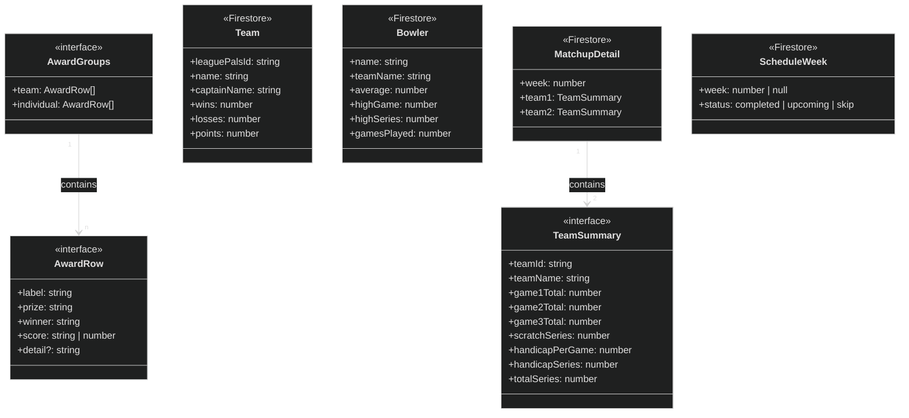

Only fields actually consumed by this feature are shown. Full interface definitions live in
`src/types/index.ts` (Firestore types) and `src/components/AwardLeaders.tsx` (computed types).

```mermaid
%%{init: {'theme': 'dark'}}%%
classDiagram
    class AwardGroups {
        <<interface>>
        +team: AwardRow[]
        +individual: AwardRow[]
    }
    class AwardRow {
        <<interface>>
        +label: string
        +prize: string
        +winner: string
        +score: string | number
        +detail?: string
    }
    class Team {
        <<Firestore>>
        +leaguePalsId: string
        +name: string
        +captainName: string
        +wins: number
        +losses: number
        +points: number
    }
    class Bowler {
        <<Firestore>>
        +name: string
        +teamName: string
        +average: number
        +highGame: number
        +highSeries: number
        +gamesPlayed: number
    }
    class MatchupDetail {
        <<Firestore>>
        +week: number
        +team1: TeamSummary
        +team2: TeamSummary
    }
    class TeamSummary {
        <<interface>>
        +teamId: string
        +teamName: string
        +game1Total: number
        +game2Total: number
        +game3Total: number
        +scratchSeries: number
        +handicapPerGame: number
        +handicapSeries: number
        +totalSeries: number
    }
    class ScheduleWeek {
        <<Firestore>>
        +week: number | null
        +status: completed | upcoming | skip
    }

    AwardGroups "1" --> "n" AwardRow : contains
    MatchupDetail "1" --> "2" TeamSummary : contains
```
