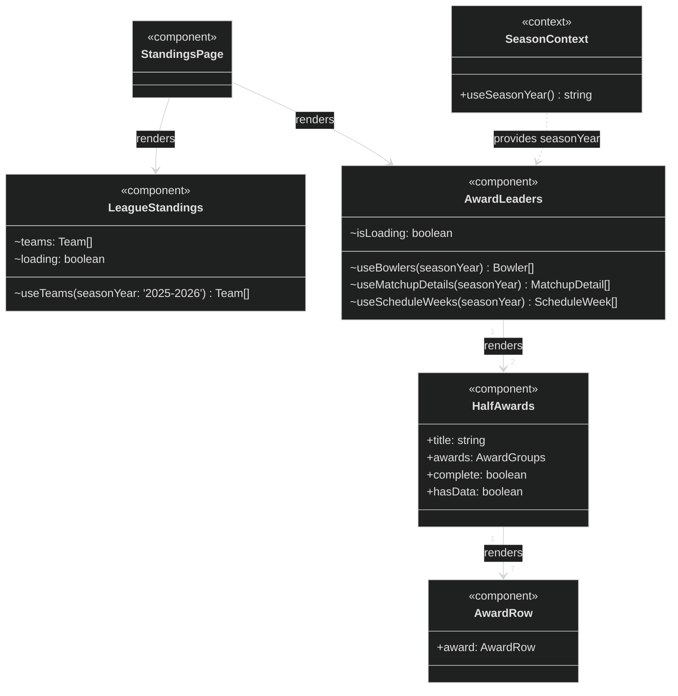

Note: `AwardRow` appears as both a React component (`<<component>>`) here and a TypeScript interface
(`<<interface>>`) in the class diagram. The `+award: AwardRow` attribute is a type annotation
referencing the interface — it does not create a recursive relationship.

