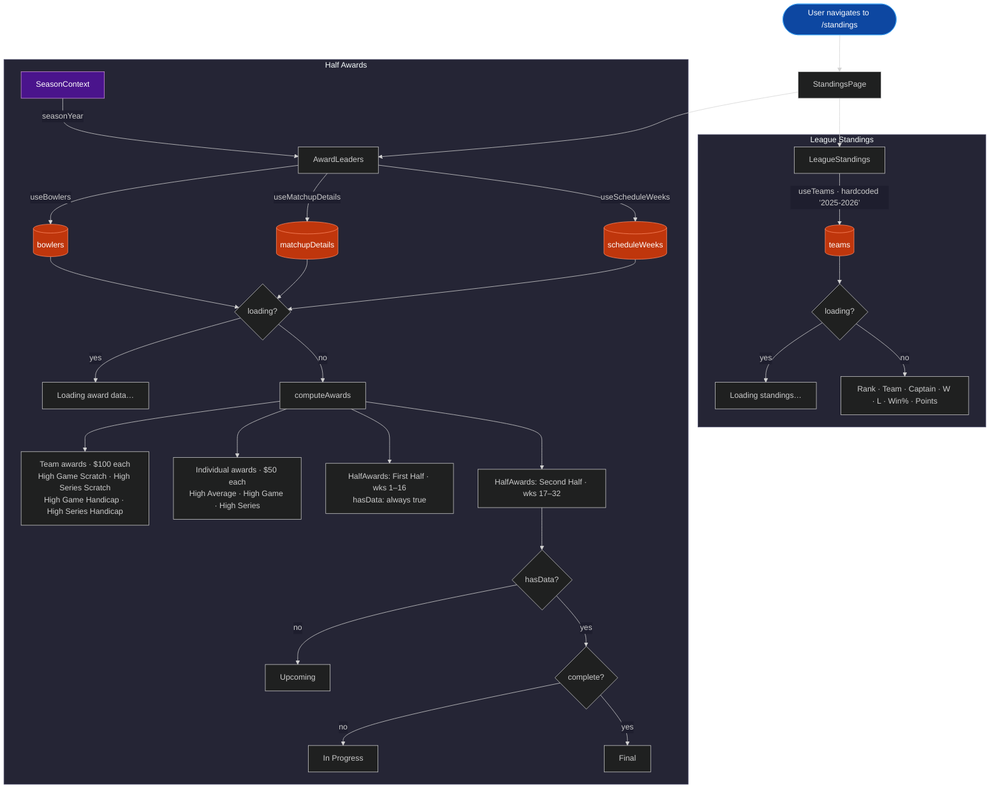

```mermaid
%%{init: {'theme': 'dark', 'themeVariables': {'edgeLabelBackground': '#1e1e2e', 'clusterBkg': '#252535', 'clusterBorder': '#4a4a6a'}}}%%
flowchart TD
    U([User navigates to /standings]) --> SP[StandingsPage]

    subgraph Standings["League Standings"]
        LS[LeagueStandings]
        LS -->|"useTeams · hardcoded '2025-2026'"| T[(teams)]
        T --> LC{loading?}
        LC -->|yes| LPH[Loading standings…]
        LC -->|no| TBL["Rank · Team · Captain · W · L · Win% · Points"]
    end

    subgraph Awards["Half Awards"]
        SC[SeasonContext] -->|seasonYear| AL[AwardLeaders]
        AL -->|useBowlers| B[(bowlers)]
        AL -->|useMatchupDetails| MD[(matchupDetails)]
        AL -->|useScheduleWeeks| SW[(scheduleWeeks)]
        B & MD & SW --> ALC{loading?}
        ALC -->|yes| ALPH[Loading award data…]
        ALC -->|no| HALF[computeAwards]
        HALF --> TEAM["Team awards · $100 each<br/>High Game Scratch · High Series Scratch<br/>High Game Handicap · High Series Handicap"]
        HALF --> INDV["Individual awards · $50 each<br/>High Average · High Game · High Series"]
        HALF --> HA1["HalfAwards: First Half · wks 1–16<br/>hasData: always true"]
        HALF --> HA2["HalfAwards: Second Half · wks 17–32"]
        HA2 --> HD1{hasData?}
        HD1 -->|no| UPC[Upcoming]
        HD1 -->|yes| HD2{complete?}
        HD2 -->|no| LIVE[In Progress]
        HD2 -->|yes| FIN[Final]
    end

    SP --> LS
    SP --> AL

    classDef trigger  fill:#0d47a1,stroke:#42a5f5,color:#fff
    classDef db       fill:#bf360c,stroke:#ff8a65,color:#fff
    classDef external fill:#4a148c,stroke:#ce93d8,color:#fff
    classDef admin    fill:#1b5e20,stroke:#81c784,color:#fff
    classDef blocked  fill:#b71c1c,stroke:#ef9a9a,color:#fff

    class U trigger
    class T,B,MD,SW db
    class SC external
```
