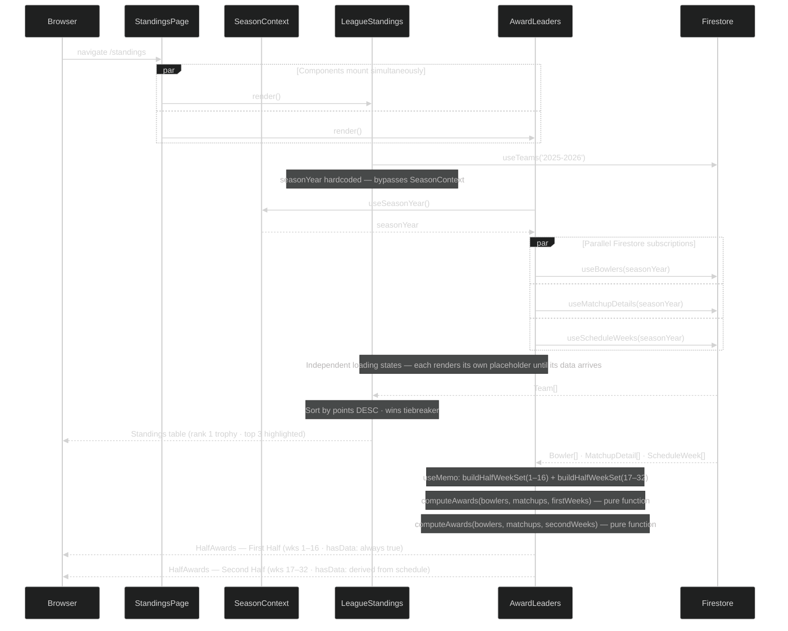

```mermaid
%%{init: {'theme': 'dark'}}%%
sequenceDiagram
    participant Browser
    participant StandingsPage
    participant SeasonContext
    participant LeagueStandings
    participant AwardLeaders
    participant Firestore

    Browser->>StandingsPage: navigate /standings

    par Components mount simultaneously
        StandingsPage->>LeagueStandings: render()
    and
        StandingsPage->>AwardLeaders: render()
    end

    LeagueStandings->>Firestore: useTeams('2025-2026')
    Note over LeagueStandings: seasonYear hardcoded — bypasses SeasonContext

    AwardLeaders->>SeasonContext: useSeasonYear()
    SeasonContext-->>AwardLeaders: seasonYear

    par Parallel Firestore subscriptions
        AwardLeaders->>Firestore: useBowlers(seasonYear)
    and
        AwardLeaders->>Firestore: useMatchupDetails(seasonYear)
    and
        AwardLeaders->>Firestore: useScheduleWeeks(seasonYear)
    end

    Note over LeagueStandings,AwardLeaders: Independent loading states — each renders its own placeholder until its data arrives

    Firestore-->>LeagueStandings: Team[]
    Note over LeagueStandings: Sort by points DESC · wins tiebreaker
    LeagueStandings-->>Browser: Standings table (rank 1 trophy · top 3 highlighted)

    Firestore-->>AwardLeaders: Bowler[] · MatchupDetail[] · ScheduleWeek[]
    Note over AwardLeaders: useMemo: buildHalfWeekSet(1–16) + buildHalfWeekSet(17–32)
    Note over AwardLeaders: computeAwards(bowlers, matchups, firstWeeks) — pure function
    Note over AwardLeaders: computeAwards(bowlers, matchups, secondWeeks) — pure function
    AwardLeaders-->>Browser: HalfAwards — First Half (wks 1–16 · hasData: always true)
    AwardLeaders-->>Browser: HalfAwards — Second Half (wks 17–32 · hasData: derived from schedule)
```
