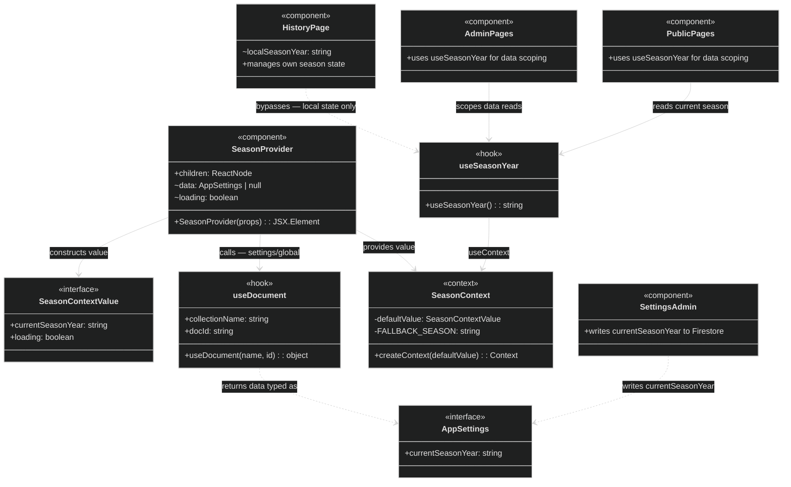

```mermaid
%%{init: {'theme': 'dark'}}%%
classDiagram
    class AppSettings {
        <<interface>>
        +currentSeasonYear: string
    }

    class SeasonContextValue {
        <<interface>>
        +currentSeasonYear: string
        +loading: boolean
    }

    class SeasonContext {
        <<context>>
        -defaultValue: SeasonContextValue
        -FALLBACK_SEASON: string
        +createContext(defaultValue): Context
    }

    class SeasonProvider {
        <<component>>
        +children: ReactNode
        ~data: AppSettings | null
        ~loading: boolean
        +SeasonProvider(props): JSX.Element
    }

    class useSeasonYear {
        <<hook>>
        +useSeasonYear(): string
    }

    class useDocument {
        <<hook>>
        +collectionName: string
        +docId: string
        +useDocument(name, id): object
    }

    class SettingsAdmin {
        <<component>>
        +writes currentSeasonYear to Firestore
    }

    class HistoryPage {
        <<component>>
        ~localSeasonYear: string
        +manages own season state
    }

    class PublicPages {
        <<component>>
        +uses useSeasonYear for data scoping
    }

    class AdminPages {
        <<component>>
        +uses useSeasonYear for data scoping
    }

    %% Context structure
    SeasonProvider --> SeasonContext : provides value
    SeasonProvider --> useDocument : calls — settings/global
    useDocument ..> AppSettings : returns data typed as
    SeasonProvider --> SeasonContextValue : constructs value

    %% Consumer hooks
    useSeasonYear --> SeasonContext : useContext

    %% Consumers of the context
    PublicPages --> useSeasonYear : reads current season
    AdminPages --> useSeasonYear : scopes data reads
    HistoryPage ..> useSeasonYear : bypasses — local state only

    %% Admin write path
    SettingsAdmin ..> AppSettings : writes currentSeasonYear
```
