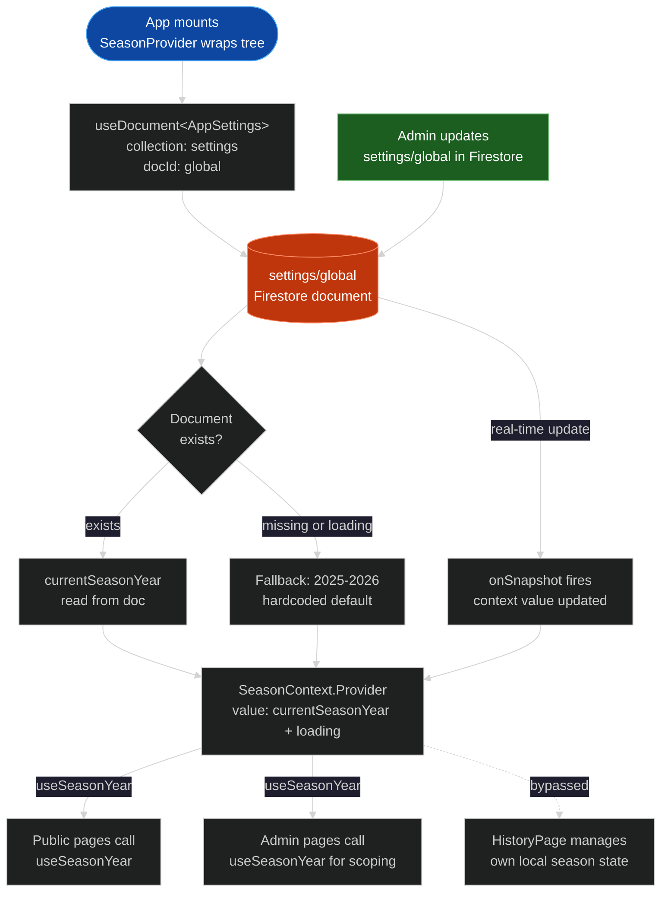

```mermaid
%%{init: {'theme': 'dark', 'themeVariables': {'edgeLabelBackground': '#1e1e2e', 'clusterBkg': '#252535', 'clusterBorder': '#4a4a6a'}}}%%
flowchart TD
    A([App mounts\nSeasonProvider wraps tree]):::trigger
    B[useDocument&lt;AppSettings&gt;\ncollection: settings\ndocId: global]
    C[(settings/global\nFirestore document)]:::db
    D{Document\nexists?}
    E[currentSeasonYear\nread from doc]
    F[Fallback: 2025-2026\nhardcoded default]
    G[SeasonContext.Provider\nvalue: currentSeasonYear + loading]
    H[Public pages call\nuseSeasonYear]
    I[Admin pages call\nuseSeasonYear for scoping]
    J[HistoryPage manages\nown local season state]
    K[Admin updates\nsettings/global in Firestore]:::admin
    L[onSnapshot fires\ncontext value updated]

    A --> B
    B --> C
    C --> D
    D -->|exists| E
    D -->|missing or loading| F
    E --> G
    F --> G
    G -->|useSeasonYear| H
    G -->|useSeasonYear| I
    G -.->|bypassed| J
    K --> C
    C -->|real-time update| L
    L --> G

    classDef trigger  fill:#0d47a1,stroke:#42a5f5,color:#fff
    classDef db       fill:#bf360c,stroke:#ff8a65,color:#fff
    classDef external fill:#4a148c,stroke:#ce93d8,color:#fff
    classDef admin    fill:#1b5e20,stroke:#81c784,color:#fff
    classDef blocked  fill:#b71c1c,stroke:#ef9a9a,color:#fff
```
