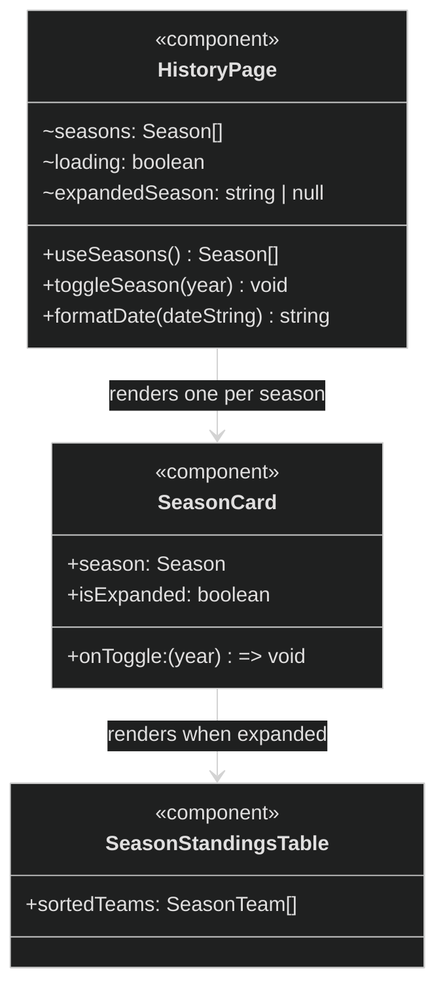

> **Note:** `SeasonCard` and `SeasonStandingsTable` are not named components — they are
> inline JSX inside `HistoryPage`'s `.map()`. They are shown as logical components here
> for clarity. All state (`expandedSeason`) and data (`seasons`) live in `HistoryPage`.
> Team data is embedded as `season.teams[]` — no child component fetches from Firestore.
