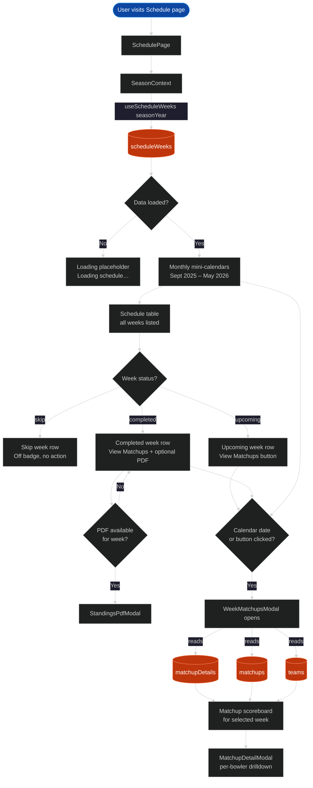

```mermaid
%%{init: {'theme': 'dark', 'themeVariables': {'edgeLabelBackground': '#1e1e2e', 'clusterBkg': '#252535', 'clusterBorder': '#4a4a6a'}}}%%
flowchart TD
    A([User visits Schedule page]):::trigger
    B[SchedulePage]
    C[SeasonContext]
    D[(scheduleWeeks)]:::db
    E{Data loaded?}
    F[Loading placeholder\nLoading schedule…]
    G[Monthly mini-calendars\nSept 2025 – May 2026]
    H[Schedule table\nall weeks listed]
    I{Week status?}
    J[Skip week row\nOff badge, no action]
    K[Upcoming week row\nView Matchups button]
    L[Completed week row\nView Matchups + optional PDF]
    M{PDF available\nfor week?}
    N[StandingsPdfModal]
    O{Calendar date\nor button clicked?}
    P[WeekMatchupsModal opens]
    Q[(matchupDetails)]:::db
    R[(matchups)]:::db
    S[(teams)]:::db
    T[Matchup scoreboard\nfor selected week]
    U[MatchupDetailModal\nper-bowler drilldown]

    A --> B
    B --> C
    C -->|useScheduleWeeks seasonYear| D
    D --> E
    E -- No --> F
    E -- Yes --> G
    G --> H
    H --> I
    I -- skip --> J
    I -- upcoming --> K
    I -- completed --> L
    L --> M
    M -- Yes --> N
    M -- No --> L
    K --> O
    L --> O
    G --> O
    O -- Yes --> P
    P -->|reads| Q
    P -->|reads| R
    P -->|reads| S
    Q --> T
    R --> T
    S --> T
    T --> U

    classDef trigger  fill:#0d47a1,stroke:#42a5f5,color:#fff
    classDef db       fill:#bf360c,stroke:#ff8a65,color:#fff
    classDef external fill:#4a148c,stroke:#ce93d8,color:#fff
    classDef admin    fill:#1b5e20,stroke:#81c784,color:#fff
    classDef blocked  fill:#b71c1c,stroke:#ef9a9a,color:#fff
```
