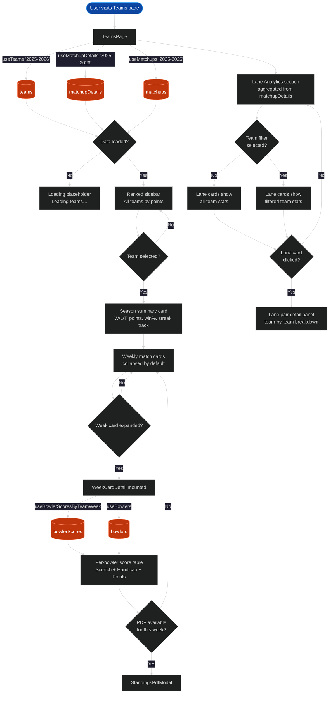

```mermaid
%%{init: {'theme': 'dark', 'themeVariables': {'edgeLabelBackground': '#1e1e2e', 'clusterBkg': '#252535', 'clusterBorder': '#4a4a6a'}}}%%
flowchart TD
    A([User visits Teams page]):::trigger
    B[TeamsPage]
    C[(teams)]:::db
    D[(matchupDetails)]:::db
    E[(matchups)]:::db
    F{Data loaded?}
    G[Loading placeholder\nLoading teams…]
    H[Ranked sidebar\nAll teams by points]
    I{Team selected?}
    J[Season summary card\nW/L/T, points, win%, streak track]
    K[Weekly match cards\ncollapsed by default]
    L{Week card expanded?}
    M[WeekCardDetail mounted]
    N[(bowlerScores)]:::db
    O[(bowlers)]:::db
    P[Per-bowler score table\nScratch + Handicap + Points]
    Q{PDF available\nfor this week?}
    R[StandingsPdfModal]
    S[Lane Analytics section\naggregated from matchupDetails]
    T{Team filter\nselected?}
    U[Lane cards show\nall-team stats]
    V[Lane cards show\nfiltered team stats]
    W{Lane card\nclicked?}
    X[Lane pair detail panel\nteam-by-team breakdown]

    A --> B
    B -->|useTeams '2025-2026'| C
    B -->|useMatchupDetails '2025-2026'| D
    B -->|useMatchups '2025-2026'| E
    C --> F
    D --> F
    E --> F
    F -- No --> G
    F -- Yes --> H
    H --> I
    I -- No --> H
    I -- Yes --> J
    J --> K
    K --> L
    L -- No --> K
    L -- Yes --> M
    M -->|useBowlerScoresByTeamWeek| N
    M -->|useBowlers| O
    N --> P
    O --> P
    P --> Q
    Q -- Yes --> R
    Q -- No --> K
    B --> S
    S --> T
    T -- No --> U
    T -- Yes --> V
    U --> W
    V --> W
    W -- Yes --> X
    W -- No --> S

    classDef trigger  fill:#0d47a1,stroke:#42a5f5,color:#fff
    classDef db       fill:#bf360c,stroke:#ff8a65,color:#fff
    classDef external fill:#4a148c,stroke:#ce93d8,color:#fff
    classDef admin    fill:#1b5e20,stroke:#81c784,color:#fff
    classDef blocked  fill:#b71c1c,stroke:#ef9a9a,color:#fff
```
