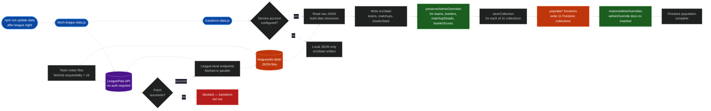

```mermaid
%%{init: {'theme': 'dark', 'themeVariables': {'edgeLabelBackground': '#1e1e2e', 'clusterBkg': '#252535', 'clusterBorder': '#4a4a6a'}}}%%
flowchart LR
    A([npm run update-data\nafter league night]):::trigger
    B([fetch-league-data.js]):::trigger
    C[("LeaguePals API\nno auth required")]:::external
    D{Fetch\nsucceeds?}
    E[blocked — transform\nnot run]:::blocked
    F[League-level endpoints\nfetched in parallel]
    G[Team roster files\nfetched sequentially × 16]
    H[(leaguepals-data/\nJSON files)]:::db
    I([transform-data.js]):::trigger
    J{Service account\nconfigured?}
    K[Local JSON only\nsrc/data/ written]
    L[Read raw JSON\nbuild data structures]
    M[Write src/data/\nteams, matchups, bowlerStats]
    N[preserveAdminOverrides\nfor teams, bowlers,\nmatchupDetails, bowlerScores]:::admin
    O[clearCollection\nfor each of 11 collections]
    P[populate* functions\nwrite 11 Firestore collections]:::db
    Q[restoreAdminOverrides\nadminOverride docs re-inserted]:::admin
    R[Firestore population\ncomplete]

    A --> B
    B --> C
    C --> D
    D -->|fail| E
    D -->|success| F
    F --> C
    G --> C
    F --> H
    G --> H
    B --> I
    I --> J
    J -->|no| K
    J -->|yes| L
    H --> L
    L --> M
    M --> N
    N --> O
    O --> P
    P --> Q
    Q --> R

    classDef trigger  fill:#0d47a1,stroke:#42a5f5,color:#fff
    classDef db       fill:#bf360c,stroke:#ff8a65,color:#fff
    classDef external fill:#4a148c,stroke:#ce93d8,color:#fff
    classDef admin    fill:#1b5e20,stroke:#81c784,color:#fff
    classDef blocked  fill:#b71c1c,stroke:#ef9a9a,color:#fff
```
