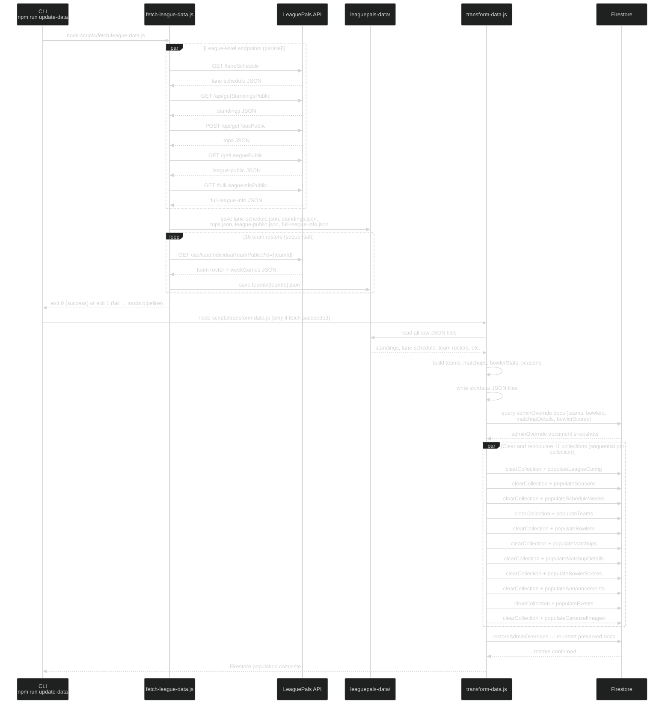

```mermaid
%%{init: {'theme': 'dark'}}%%
sequenceDiagram
    participant CLI as CLI<br/>npm run update-data
    participant Fetch as fetch-league-data.js
    participant API as LeaguePals API
    participant Files as leaguepals-data/
    participant Transform as transform-data.js
    participant Firestore as Firestore

    CLI ->> Fetch: node scripts/fetch-league-data.js

    par League-level endpoints (parallel)
        Fetch ->> API: GET /laneSchedule
        API -->> Fetch: lane-schedule JSON
        Fetch ->> API: GET /api/getStandingsPublic
        API -->> Fetch: standings JSON
        Fetch ->> API: POST /api/getTopsPublic
        API -->> Fetch: tops JSON
        Fetch ->> API: GET /getLeaguePublic
        API -->> Fetch: league-public JSON
        Fetch ->> API: GET /fullLeagueInfoPublic
        API -->> Fetch: full-league-info JSON
    end

    Fetch ->> Files: save lane-schedule.json, standings.json,<br/>tops.json, league-public.json, full-league-info.json

    loop 16 team rosters (sequential)
        Fetch ->> API: GET /api/loadIndividualTeamPublic?id={teamId}
        API -->> Fetch: team roster + weekGames JSON
        Fetch ->> Files: save teams/{teamId}.json
    end

    Fetch -->> CLI: exit 0 (success) or exit 1 (fail → stops pipeline)

    CLI ->> Transform: node scripts/transform-data.js (only if fetch succeeded)

    Transform ->> Files: read all raw JSON files
    Files -->> Transform: standings, lane-schedule, team rosters, etc.

    Transform ->> Transform: build teams, matchups, bowlerStats, seasons
    Transform ->> Transform: write src/data/ JSON files

    Transform ->> Firestore: query adminOverride docs (teams, bowlers,<br/>matchupDetails, bowlerScores)
    Firestore -->> Transform: adminOverride document snapshots

    par Clear and repopulate 11 collections (sequential per collection)
        Transform ->> Firestore: clearCollection + populateLeagueConfig
        Transform ->> Firestore: clearCollection + populateSeasons
        Transform ->> Firestore: clearCollection + populateScheduleWeeks
        Transform ->> Firestore: clearCollection + populateTeams
        Transform ->> Firestore: clearCollection + populateBowlers
        Transform ->> Firestore: clearCollection + populateMatchups
        Transform ->> Firestore: clearCollection + populateMatchupDetails
        Transform ->> Firestore: clearCollection + populateBowlerScores
        Transform ->> Firestore: clearCollection + populateAnnouncements
        Transform ->> Firestore: clearCollection + populateEvents
        Transform ->> Firestore: clearCollection + populateCarouselImages
    end

    Transform ->> Firestore: restoreAdminOverrides — re-insert preserved docs
    Firestore -->> Transform: restore confirmed

    Transform -->> CLI: Firestore population complete
```
