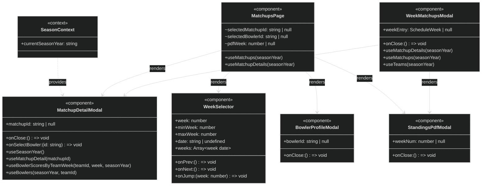

```mermaid
%%{init: {'theme': 'dark'}}%%
classDiagram
    class SeasonContext {
        <<context>>
        +currentSeasonYear: string
    }

    class MatchupsPage {
        <<component>>
        ~selectedMatchupId: string | null
        ~selectedBowlerId: string | null
        ~pdfWeek: number | null
        +useMatchups(seasonYear)
        +useMatchupDetails(seasonYear)
    }

    class WeekSelector {
        <<component>>
        +week: number
        +minWeek: number
        +maxWeek: number
        +date: string | undefined
        +weeks: Array~week date~
        +onPrev: () => void
        +onNext: () => void
        +onJump: (week: number) => void
    }

    class MatchupDetailModal {
        <<component>>
        +matchupId: string | null
        +onClose: () => void
        +onSelectBowler: (id: string) => void
        +useSeasonYear()
        +useMatchupDetail(matchupId)
        +useBowlerScoresByTeamWeek(teamId, week, seasonYear)
        +useBowlers(seasonYear, teamId)
    }

    class BowlerProfileModal {
        <<component>>
        +bowlerId: string | null
        +onClose: () => void
    }

    class StandingsPdfModal {
        <<component>>
        +weekNum: number | null
        +onClose: () => void
    }

    class WeekMatchupsModal {
        <<component>>
        +weekEntry: ScheduleWeek | null
        +onClose: () => void
        +useMatchupDetails(seasonYear)
        +useMatchups(seasonYear)
        +useTeams(seasonYear)
    }

    SeasonContext ..> MatchupDetailModal : provides

    MatchupsPage --> WeekSelector : renders
    MatchupsPage --> MatchupDetailModal : renders
    MatchupsPage --> BowlerProfileModal : renders
    MatchupsPage --> StandingsPdfModal : renders

    WeekMatchupsModal --> MatchupDetailModal : renders nested
    WeekMatchupsModal --> StandingsPdfModal : renders
```
