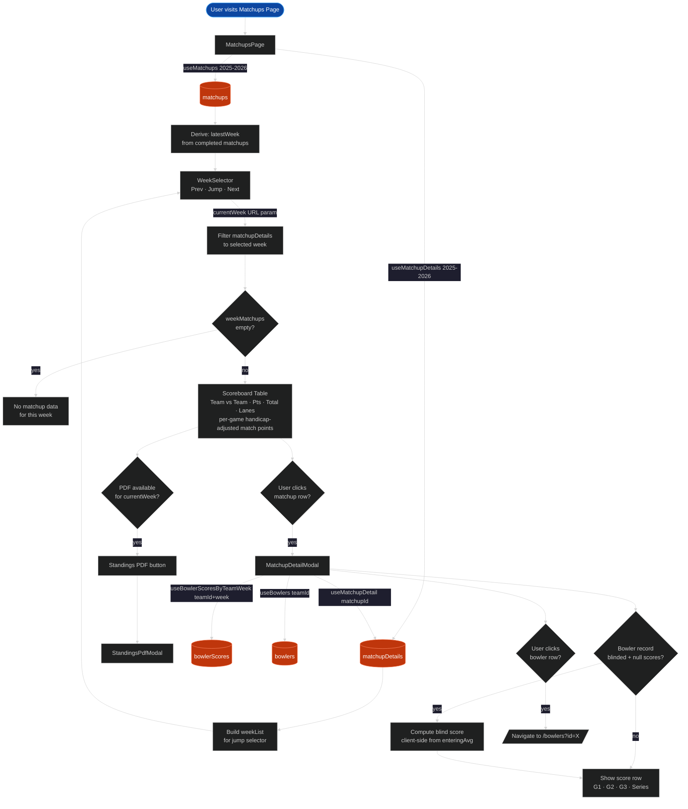

```mermaid
%%{init: {'theme': 'dark', 'themeVariables': {'edgeLabelBackground': '#1e1e2e', 'clusterBkg': '#252535', 'clusterBorder': '#4a4a6a'}}}%%
flowchart TD
    USER([User visits Matchups Page]):::trigger

    USER --> MP[MatchupsPage]
    MP -->|useMatchups 2025-2026| MDBLIGHT[(matchups)]:::db
    MP -->|useMatchupDetails 2025-2026| MDDDB[(matchupDetails)]:::db

    MDBLIGHT --> DERIVE[Derive: latestWeek\nfrom completed matchups]
    MDDDB --> WEEKLIST[Build weekList\nfor jump selector]

    DERIVE --> WSEL[WeekSelector\nPrev · Jump · Next]
    WEEKLIST --> WSEL

    WSEL -->|currentWeek URL param| FILTER[Filter matchupDetails\nto selected week]

    FILTER --> NODATA{weekMatchups\nempty?}
    NODATA -->|yes| EMPTY[No matchup data\nfor this week]
    NODATA -->|no| TABLE[Scoreboard Table\nTeam vs Team · Pts · Total · Lanes\nper-game handicap-adjusted match points]

    TABLE --> PDFCHECK{PDF available\nfor currentWeek?}
    PDFCHECK -->|yes| PDFBAR[Standings PDF button]
    PDFBAR --> PDFMODAL[StandingsPdfModal]

    TABLE --> ROWCLICK{User clicks\nmatchup row?}
    ROWCLICK -->|yes| DETAILMODAL[MatchupDetailModal]

    DETAILMODAL -->|useMatchupDetail matchupId| MDDDB
    DETAILMODAL -->|useBowlerScoresByTeamWeek teamId+week| BSDB[(bowlerScores)]:::db
    DETAILMODAL -->|useBowlers teamId| BDB[(bowlers)]:::db

    DETAILMODAL --> BLINDCHECK{Bowler record\nblinded + null scores?}
    BLINDCHECK -->|yes| BLINDCALC[Compute blind score\nclient-side from enteringAvg]
    BLINDCHECK -->|no| SCOREROW[Show score row\nG1 · G2 · G3 · Series]
    BLINDCALC --> SCOREROW

    DETAILMODAL --> BOWLERCLICK{User clicks\nbowler row?}
    BOWLERCLICK -->|yes| NAVIGATE[/Navigate to /bowlers?id=X/]

    classDef trigger  fill:#0d47a1,stroke:#42a5f5,color:#fff
    classDef db       fill:#bf360c,stroke:#ff8a65,color:#fff
    classDef external fill:#4a148c,stroke:#ce93d8,color:#fff
    classDef admin    fill:#1b5e20,stroke:#81c784,color:#fff
    classDef blocked  fill:#b71c1c,stroke:#ef9a9a,color:#fff
```
