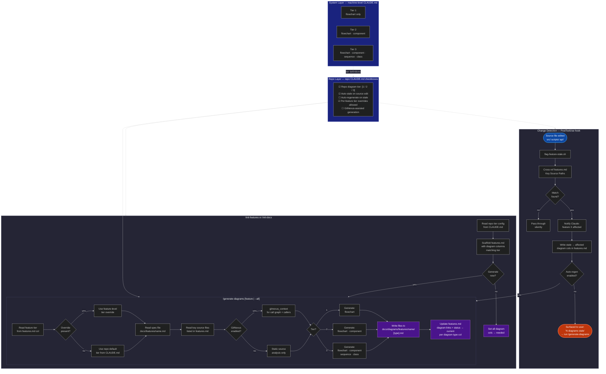

```mermaid
%%{init: {'theme': 'dark', 'themeVariables': {'edgeLabelBackground': '#1e1e2e', 'clusterBkg': '#252535', 'clusterBorder': '#4a4a6a'}}}%%
flowchart TD

    %% ── Config Layer ──────────────────────────────────────────────────────────
    subgraph SYS["System Layer — machine-level CLAUDE.md"]
        direction LR
        T1["Tier 1\nflowchart only"]
        T2["Tier 2\nflowchart · component"]
        T3["Tier 3\nflowchart · component · sequence · class"]
    end

    subgraph REPO["Repo Layer — repo CLAUDE.md checkboxes"]
        direction LR
        RC["☑ Repo diagram tier: [1 / 2 / 3]\n☑ Auto-stale on source edit\n☐ Auto-regenerate on stale\n☑ Per-feature tier overrides allowed\n☐ GitNexus-assisted generation"]
    end

    SYS -->|"tier definitions"| REPO

    %% ── Init Path ─────────────────────────────────────────────────────────────
    subgraph INIT["/init-features or /init-docs"]
        I1[Read repo tier config\nfrom CLAUDE.md] --> I2["Scaffold features.md\nwith diagram columns\nmatching tier"]
        I2 --> I3{Generate\nnow?}
        I3 -->|yes| GEN
        I3 -->|no| I4["Set all diagram\ncols → needed"]
    end

    %% ── Change Detection ──────────────────────────────────────────────────────
    subgraph CHANGE["Change Detection — PostToolUse hook"]
        C1(["Source file edited\nsrc/  scripts/  api/"]) --> C2["flag-feature-stale.sh"]
        C2 --> C3["Cross-ref features.md\nKey Source Paths"]
        C3 --> C4{Match\nfound?}
        C4 -->|no| C5["Pass through\nsilently"]
        C4 -->|yes| C6["Notify Claude:\nfeature X affected"]
        C6 --> C7["Write stale → affected\ndiagram cols in features.md"]
        C7 --> C8{Auto-regen\nenabled?}
        C8 -->|yes| GEN
        C8 -->|no| C9(["Surfaced to user:\n'N diagrams stale'\n→ run /generate-diagrams"])
    end

    %% ── Generation ────────────────────────────────────────────────────────────
    subgraph GEN["/generate-diagrams [feature | --all]"]
        G1["Read feature tier\nfrom features.md col"] --> G2{Override\npresent?}
        G2 -->|yes| G2A["Use feature-level\ntier override"]
        G2 -->|no| G2B["Use repo default\ntier from CLAUDE.md"]
        G2A & G2B --> G3["Read spec file\ndocs/features/name.md"]
        G3 --> G4["Read key source files\nlisted in features.md"]
        G4 --> G5{GitNexus\nenabled?}
        G5 -->|yes| G5A["gitnexus_context\nfor call graph + callers"]
        G5 -->|no| G5B["Static source\nanalysis only"]
        G5A & G5B --> G6{Tier?}
        G6 -->|1| GA["Generate:\nflowchart"]
        G6 -->|2| GB["Generate:\nflowchart · component"]
        G6 -->|3| GC["Generate:\nflowchart · component\nsequence · class"]
        GA & GB & GC --> G7["Write files to\ndocs/diagrams/features/name/\n[type].md"]
        G7 --> G8["Update features.md\ndiagram links + status → current\nper diagram type col"]
    end

    %% ── Connections ───────────────────────────────────────────────────────────
    REPO --> INIT
    REPO --> CHANGE
    REPO --> GEN

    classDef config   fill:#1a237e,stroke:#5c6bc0,color:#fff
    classDef trigger  fill:#0d47a1,stroke:#42a5f5,color:#fff
    classDef process  fill:#1b5e20,stroke:#81c784,color:#fff
    classDef decision fill:#212121,stroke:#90a4ae,color:#fff
    classDef output   fill:#4a148c,stroke:#ce93d8,color:#fff
    classDef warning  fill:#bf360c,stroke:#ff8a65,color:#fff

    class SYS,REPO config
    class C1 trigger
    class C9 warning
    class I4 output
    class G7,G8 output
```
